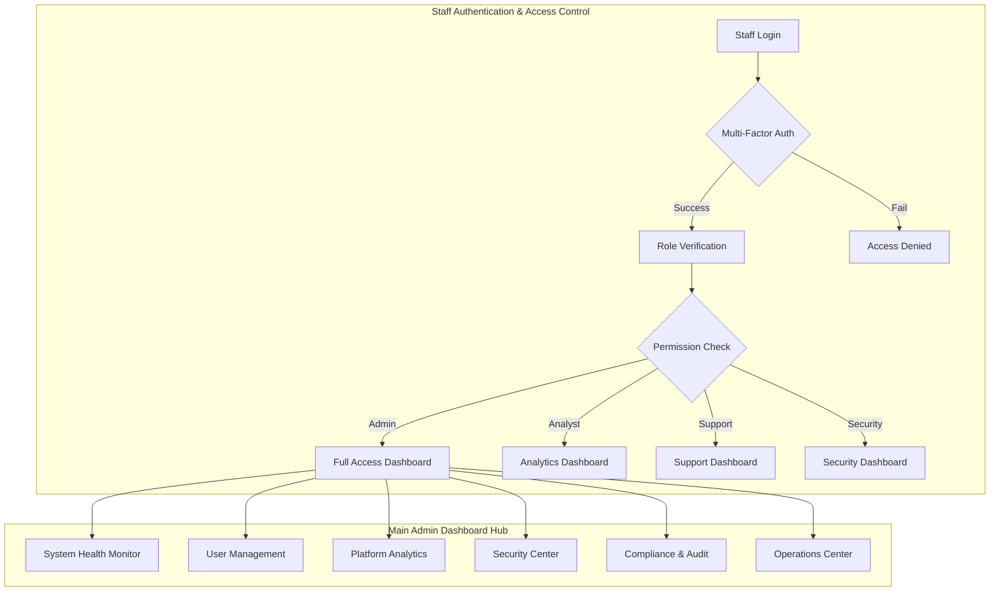
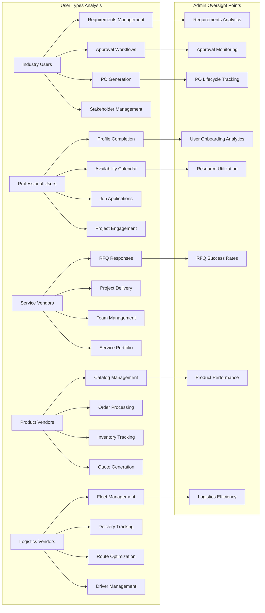
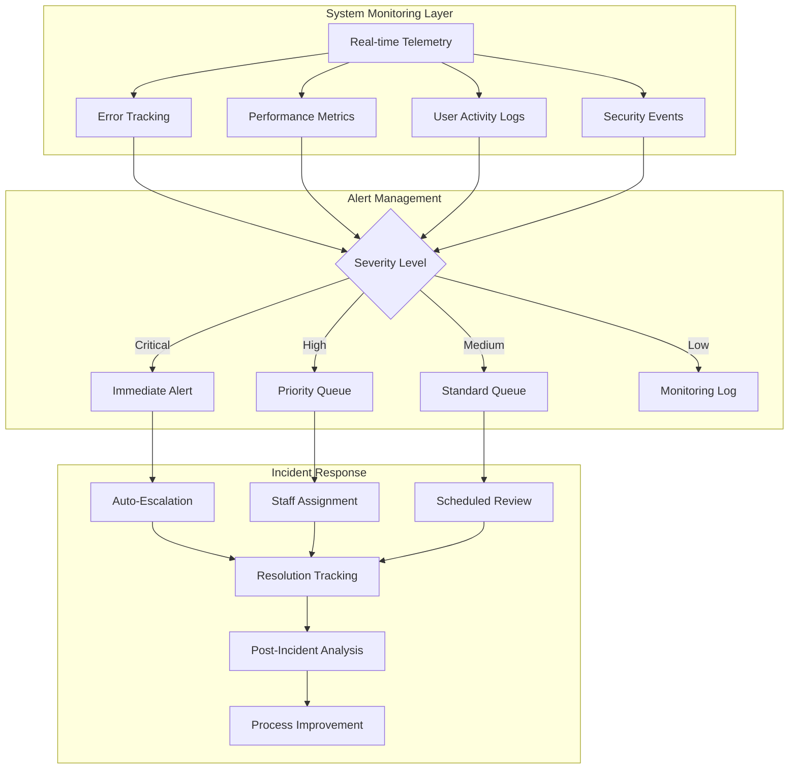
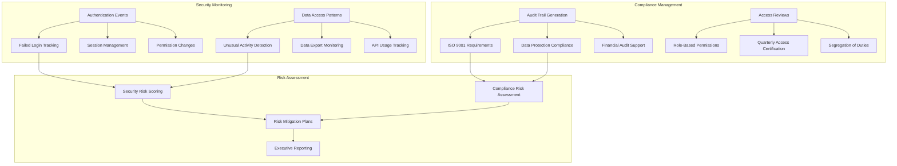
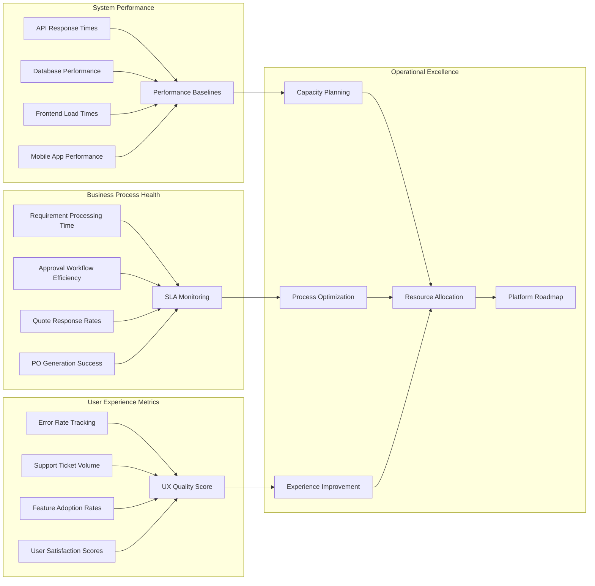
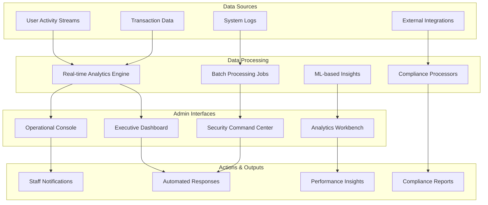
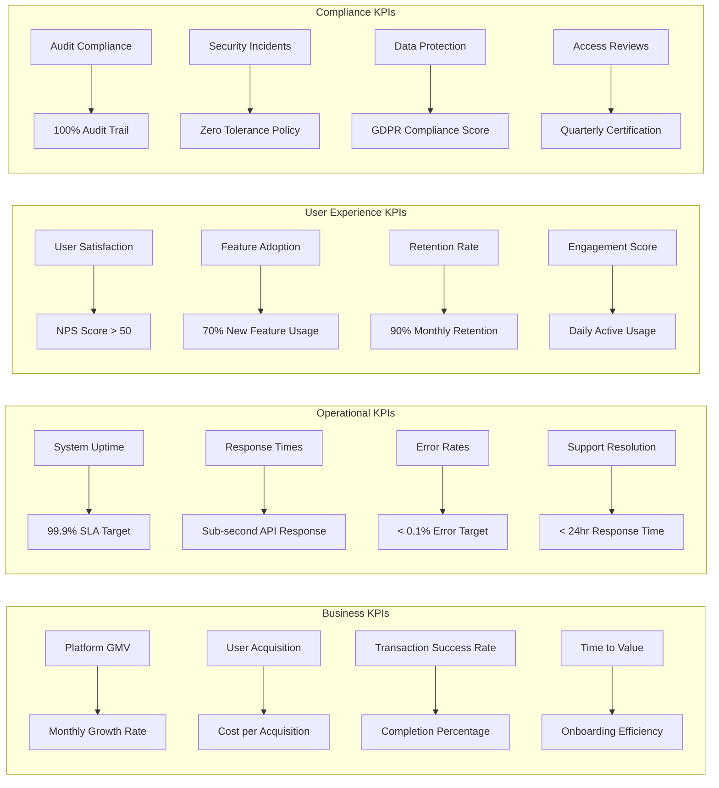

# Diligince.ai Staff Admin Panel - Enterprise Flow Chart

## System Overview Architecture

## Core User Ecosystem Monitoring

## Real-Time Monitoring & Incident Response

## User Lifecycle & Retention Analytics

```mermaid
graph LR
    subgraph "User Acquisition"
        A[Registration Events] --> B[Signup Source Tracking]
        B --> C[Role Selection Analytics]
        C --> D[Onboarding Completion Rates]
    end

    subgraph "User Engagement"
        D --> E[Daily Active Users]
        E --> F[Feature Usage Patterns]
        F --> G[Session Duration Analysis]
        G --> H[User Journey Mapping]
    end

    subgraph "Retention & Churn"
        H --> I[Retention Cohorts]
        I --> J[Churn Prediction]
        J --> K[Re-engagement Campaigns]
        K --> L[Success Rate Tracking]
    end

    subgraph "Value Realization"
        L --> M[Transaction Volume]
        M --> N[Revenue per User]
        N --> O[Platform GMV]
        O --> P[Success Story Identification]
    end
```

## Security & Compliance Framework

## Operations & Platform Health

## Admin Panel Navigation Structure

```mermaid
graph TD
    A[Admin Dashboard] --> B[System Overview]
    A --> C[User Management]
    A --> D[Business Intelligence]
    A --> E[Security Center]
    A --> F[Operations]
    A --> G[Settings]

    B --> B1[System Health]
    B --> B2[Performance Metrics]
    B --> B3[Alert Center]
    B --> B4[Incident Management]

    C --> C1[User Registry]
    C --> C2[Role Management]
    C --> C3[Onboarding Analytics]
    C --> C4[Activity Monitoring]

    D --> D1[Platform Analytics]
    D --> D2[Revenue Analytics]
    D --> D3[User Behavior]
    D --> D4[Market Intelligence]

    E --> E1[Access Control]
    E --> E2[Audit Logs]
    E --> E3[Compliance Reports]
    E --> E4[Security Incidents]

    F --> F1[Requirement Oversight]
    F --> F2[Approval Workflows]
    F --> F3[Transaction Monitoring]
    F --> F4[Quality Assurance]

    G --> G1[System Configuration]
    G --> G2[Integration Management]
    G --> G3[Notification Settings]
    G --> G4[Backup & Recovery]
```

## Data Flow & Integration Points

## Key Performance Indicators (KPIs) Tracking

