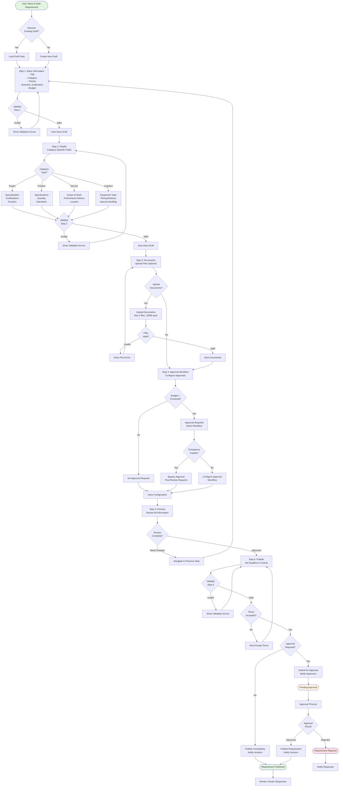
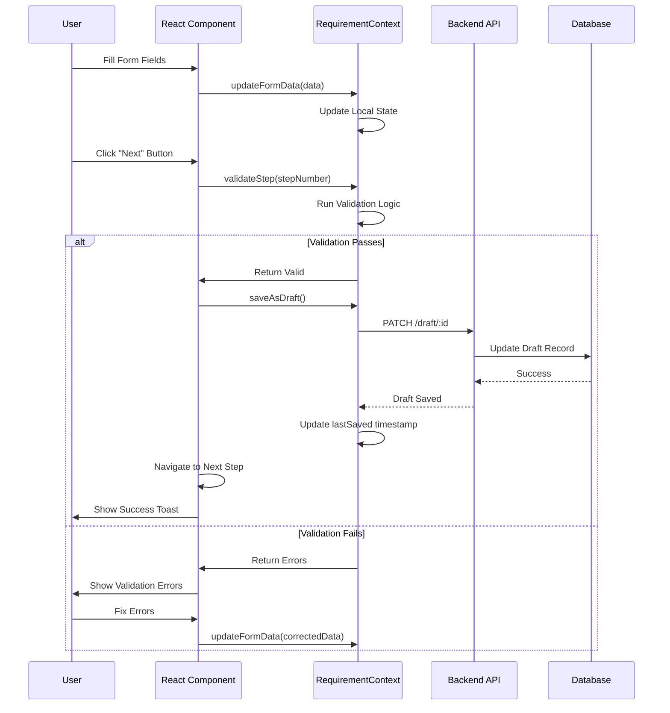
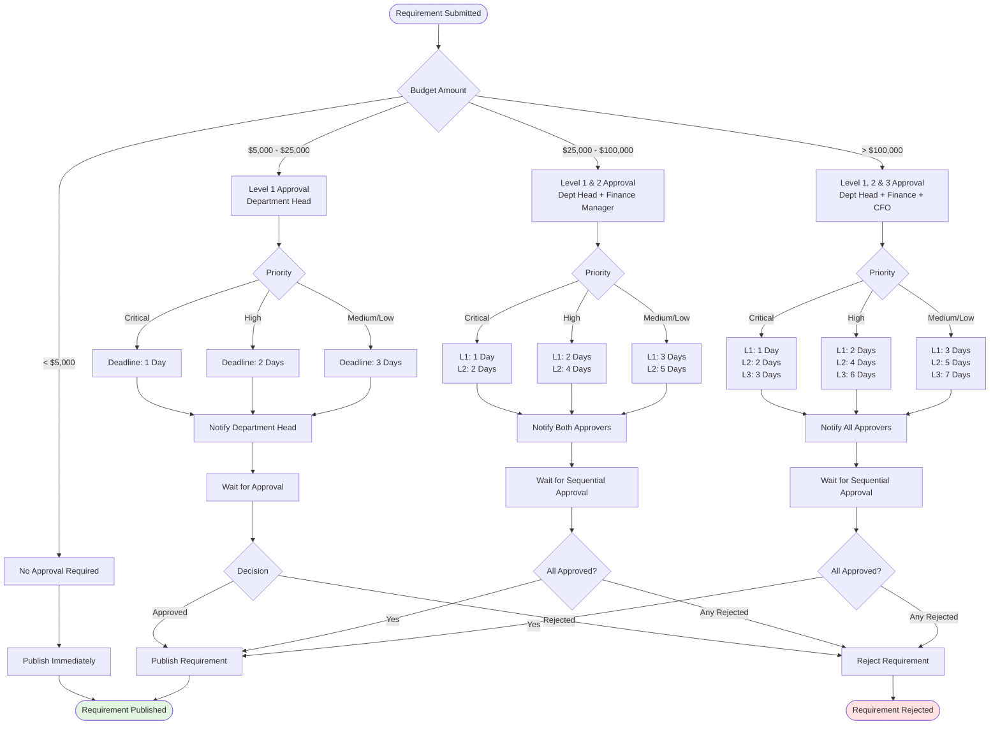
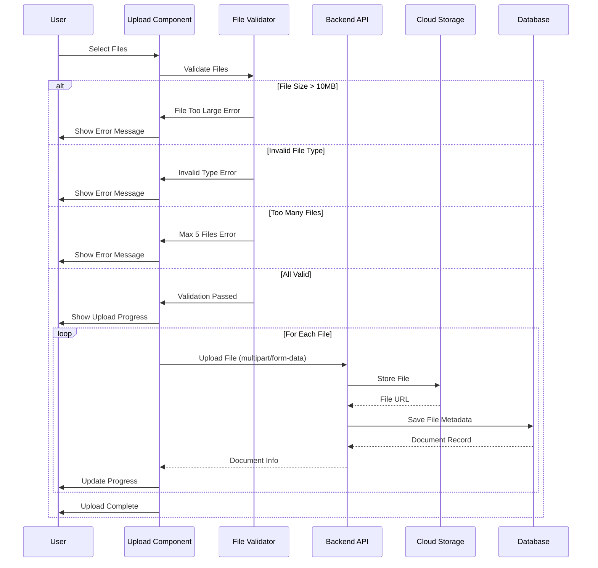
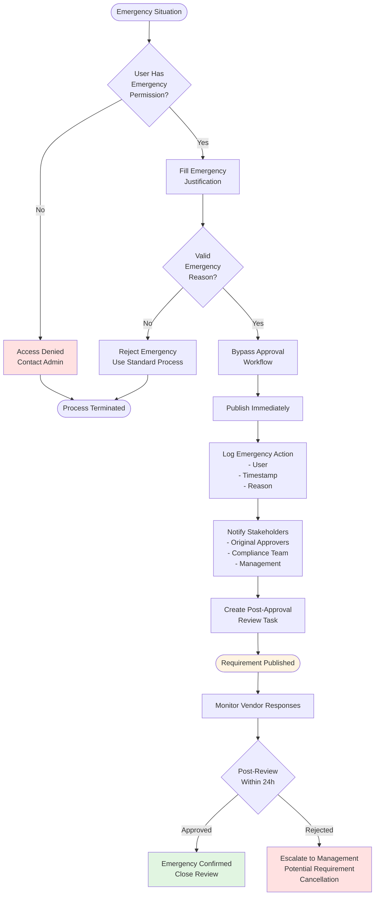
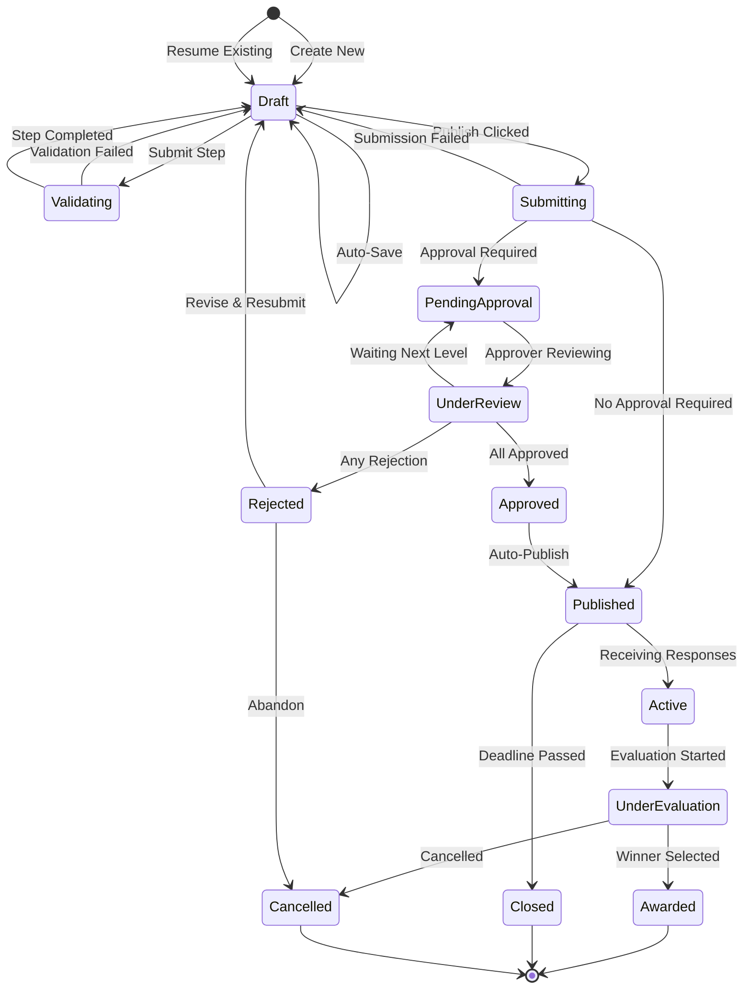
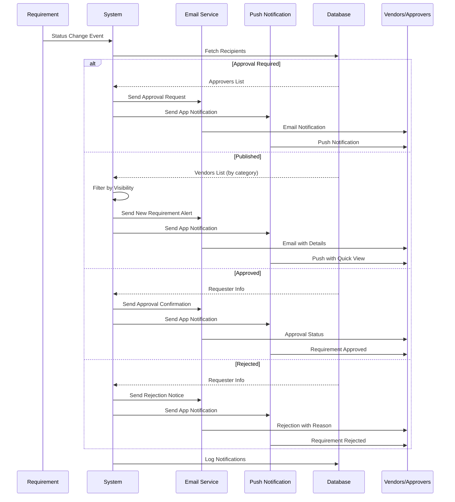
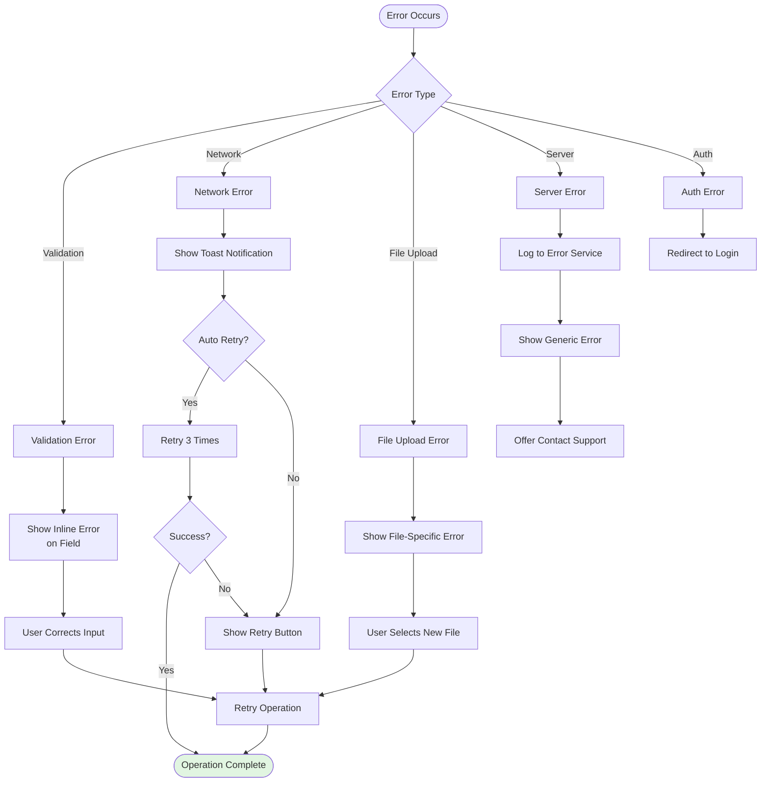

# Create Requirement Workflow Documentation

## Overview

This document provides visual workflow diagrams and business logic documentation for the Create Requirement process.

---

## Complete 6-Step Workflow

---

## Auto-Save Draft Mechanism

---

## Approval Workflow Decision Tree

---

## Document Upload Flow

---

## Emergency Publish Workflow

---

## State Transitions

---

## Notification Flow

---

## Business Rules

### Budget Thresholds

| Budget Range | Approval Levels | Typical Timeline |
|--------------|-----------------|------------------|
| < $5,000 | None | Immediate |
| $5,000 - $25,000 | Department Head | 1-3 days |
| $25,000 - $100,000 | Dept Head + Finance | 3-5 days |
| > $100,000 | Dept Head + Finance + CFO | 5-7 days |

### Priority-Based Deadlines

| Priority | Approval Deadline | Submission Deadline (Min) |
|----------|-------------------|---------------------------|
| Critical | 1 day per level | 3 days |
| High | 2 days per level | 5 days |
| Medium | 3 days per level | 7 days |
| Low | 5 days per level | 14 days |

### Document Requirements

| Category | Required Documents | Optional Documents |
|----------|-------------------|-------------------|
| Expert | Scope of Work | Certifications, References |
| Product | Specifications | Drawings, Compliance Docs |
| Service | Scope of Work, SLA | Performance History |
| Logistics | Route Details, Permits | Safety Certifications |

### Validation Rules by Step

**Step 1 - Basic Information:**
- Title: 5-200 characters
- Category: Must select one
- Priority: Must select one
- Business Justification: 20-1000 characters
- Department: Required
- Cost Center: Required, format XXX-NNN
- Estimated Budget: > 0

**Step 2 - Details (Category-Specific):**
- Expert: Specialization + Description required
- Product: Specifications + Quantity required
- Service: Description + Scope + Metrics + Location required
- Logistics: Equipment + Pickup + Delivery required

**Step 3 - Documents:**
- Optional step
- Max 5 files, 10MB each
- Allowed types: PDF, DOC, DOCX, XLS, XLSX, DWG, PNG, JPG

**Step 4 - Approval:**
- Conditional based on budget
- Emergency publish requires special permission

**Step 6 - Publish:**
- Submission deadline: Minimum 3 days from now
- Evaluation criteria: At least 1 required
- Terms acceptance: Required

---

## Error Handling Strategy

---

## Performance Considerations

### Auto-Save Strategy
- Debounce: 2 seconds after user stops typing
- Throttle: Maximum 1 save per 3 seconds
- Background: Non-blocking operation
- Retry: Automatic retry on failure (max 3 attempts)

### File Upload Optimization
- Chunked upload for files > 5MB
- Parallel uploads (max 3 simultaneous)
- Resume capability for failed uploads
- Client-side compression for images

### Validation Strategy
- Client-side validation: Immediate feedback
- Server-side validation: Before save
- Step validation: Before proceeding
- Final validation: Before publish

---

## Integration Points

### External Systems

1. **Approval System**
   - Workflow engine integration
   - Approver notification system
   - Audit trail logging

2. **Document Management**
   - Cloud storage integration
   - Version control
   - Access control

3. **Notification System**
   - Email service (SendGrid/SES)
   - Push notification service
   - In-app notification system

4. **Analytics**
   - Event tracking
   - User behavior analytics
   - Performance monitoring

5. **Compliance System**
   - Audit logging
   - Regulatory compliance checks
   - Document retention policies