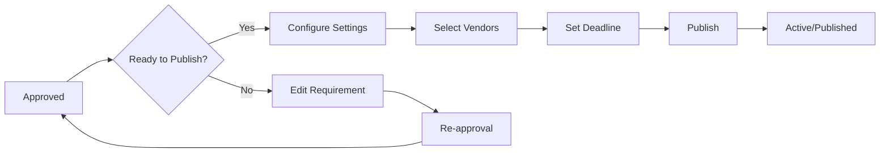

# Requirements Approved API Documentation

## Table of Contents
1. [Quick Start](#quick-start)
2. [API Endpoints](#api-endpoints)
3. [Data Models](#data-models)
4. [Business Rules & Logic](#business-rules--logic)
5. [Filtering & Sorting](#filtering--sorting)
6. [Permissions & Authorization](#permissions--authorization)
7. [UI Integration Guide](#ui-integration-guide)
8. [Error Handling](#error-handling)
9. [Testing Examples](#testing-examples)
10. [Appendix](#appendix)

---

## Quick Start

The Requirements Approved API manages requirements that have successfully completed the approval workflow and are ready to be published to vendors. This API enables:

- Viewing all approved requirements
- Publishing requirements to the vendor marketplace
- Editing approved requirements (with re-approval if needed)
- Revoking approvals when necessary
- Configuring publication settings

**Key Use Cases:**
- Industry users publishing approved requirements to vendors
- Configuring submission deadlines and evaluation criteria
- Selecting which vendors should receive notifications
- Scheduling requirement publications
- Bulk publishing multiple requirements

**Publication Workflow:**


**Related Documentation:**
- [Requirements Pending API](./requirements-pending-api.md) - Approval process
- [Requirements Published API](./requirements-published-api.md) - After publication
- [Vendor Management API](./vendor-management-api.md) - Vendor selection

---

## API Endpoints

### 1. List Approved Requirements

Retrieve all approved requirements ready for publication.

**Endpoint:** `GET /api/industry/requirements/approved`

**Query Parameters:**
```typescript
{
  page?: number;              // Default: 1
  pageSize?: number;          // Default: 10, Max: 100
  sortBy?: string;            // 'approvedDate' | 'estimatedValue' | 'priority' | 'title'
  sortOrder?: string;         // 'asc' | 'desc', Default: 'desc'
  category?: string;          // Filter by category
  priority?: string;          // Filter by priority
  approvedBy?: string;        // Filter by final approver
  dateFrom?: string;          // ISO date
  dateTo?: string;            // ISO date
  minValue?: number;          // Min estimated value
  maxValue?: number;          // Max estimated value
  expiringWithin?: number;    // Days until expiration (e.g., 7)
}
```

**Request Example:**
```bash
curl -X GET 'https://api.Diligince.ai/api/industry/requirements/approved?page=1&pageSize=10&sortBy=approvedDate&sortOrder=desc' \
  -H 'Authorization: Bearer <token>' \
  -H 'Content-Type: application/json'
```

**Response (200 OK):**
```json
{
  "success": true,
  "data": [
    {
      "id": "req_abc123",
      "requirementId": "REQ-001",
      "title": "Software Development Services",
      "category": "IT Services",
      "priority": "High",
      "estimatedValue": "$50,000",
      "estimatedValueRaw": 50000,
      "approvedDate": "2024-01-20T14:30:00Z",
      "approvedBy": {
        "id": "user_789",
        "name": "Bob Wilson",
        "role": "Finance Manager"
      },
      "submittedBy": {
        "id": "user_123",
        "name": "John Doe",
        "department": "Engineering"
      },
      "approvalChain": [
        {
          "level": 1,
          "approver": "Jane Smith (Dept Head)",
          "approvedAt": "2024-01-18T10:00:00Z",
          "status": "approved"
        },
        {
          "level": 2,
          "approver": "Bob Wilson (Finance)",
          "approvedAt": "2024-01-20T14:30:00Z",
          "status": "approved"
        }
      ],
      "expiresAt": "2024-02-20T14:30:00Z",
      "daysUntilExpiration": 30,
      "isExpiringSoon": false,
      "canPublish": true,
      "canEdit": true,
      "publishedStatus": "not_published",
      "summary": "Custom CRM system development..."
    }
  ],
  "pagination": {
    "currentPage": 1,
    "pageSize": 10,
    "totalItems": 8,
    "totalPages": 1,
    "hasNextPage": false,
    "hasPreviousPage": false
  },
  "summary": {
    "totalApproved": 8,
    "totalValueApproved": "$450,000",
    "readyToPublish": 6,
    "expiringSoon": 2
  }
}
```

---

### 2. Get Approved Requirement Details

Retrieve full details of a specific approved requirement.

**Endpoint:** `GET /api/industry/requirements/:requirementId`

**Path Parameters:**
- `requirementId` (string, required) - The unique requirement identifier

**Request Example:**
```bash
curl -X GET 'https://api.Diligince.ai/api/industry/requirements/req_abc123' \
  -H 'Authorization: Bearer <token>'
```

**Response (200 OK):**
```json
{
  "success": true,
  "data": {
    "id": "req_abc123",
    "requirementId": "REQ-001",
    "title": "Software Development Services",
    "description": "We need a custom CRM system...",
    "category": "IT Services",
    "subcategory": "Custom Software Development",
    "priority": "High",
    "estimatedValue": {
      "amount": 50000,
      "currency": "USD",
      "formatted": "$50,000",
      "budgetRange": {
        "min": 25000,
        "max": 75000
      }
    },
    "specifications": {
      "requirementType": "Technical",
      "technicalDetails": "...",
      "deliveryRequirements": "...",
      "qualityStandards": ["ISO 9001"],
      "timeline": {
        "expectedStartDate": "2024-02-01",
        "expectedEndDate": "2024-08-01",
        "duration": "6 months"
      }
    },
    "documents": [
      {
        "id": "doc_123",
        "filename": "technical_spec.pdf",
        "url": "https://storage.Diligince.ai/doc_123"
      }
    ],
    "approvalWorkflow": {
      "completedAt": "2024-01-20T14:30:00Z",
      "approvalChain": [
        {
          "level": 1,
          "approver": {
            "id": "user_456",
            "name": "Jane Smith",
            "role": "Department Head"
          },
          "approvedAt": "2024-01-18T10:00:00Z",
          "comments": "Approved. Budget confirmed."
        },
        {
          "level": 2,
          "approver": {
            "id": "user_789",
            "name": "Bob Wilson",
            "role": "Finance Manager"
          },
          "approvedAt": "2024-01-20T14:30:00Z",
          "comments": "Final approval granted."
        }
      ]
    },
    "submittedBy": {
      "id": "user_123",
      "name": "John Doe",
      "email": "john.doe@company.com",
      "department": "Engineering"
    },
    "metadata": {
      "createdAt": "2024-01-15T10:00:00Z",
      "approvedAt": "2024-01-20T14:30:00Z",
      "expiresAt": "2024-02-20T14:30:00Z",
      "status": "approved",
      "canEdit": true,
      "canPublish": true,
      "canRevokeApproval": true
    }
  }
}
```

---

### 3. Publish Requirement

Publish an approved requirement to vendors with configuration settings.

**Endpoint:** `POST /api/industry/requirements/:requirementId/publish`

**Path Parameters:**
- `requirementId` (string, required) - The unique requirement identifier

**Request Body:**
```json
{
  "publishSettings": {
    "submissionDeadline": "2024-02-15T17:00:00Z",
    "visibility": "selected_vendors",
    "selectedVendors": ["vendor_123", "vendor_456", "vendor_789"],
    "autoMatch": true,
    "evaluationCriteria": {
      "technicalCapability": 30,
      "pricing": 40,
      "experience": 20,
      "timeline": 10
    },
    "requireNDA": true,
    "allowQuestions": true,
    "questionsDeadline": "2024-02-10T17:00:00Z"
  },
  "notifications": {
    "sendEmail": true,
    "sendInApp": true,
    "sendSMS": false,
    "customMessage": "We invite you to submit a proposal for our CRM development project..."
  },
  "termsAccepted": true
}
```

**Request Example:**
```bash
curl -X POST 'https://api.Diligince.ai/api/industry/requirements/req_abc123/publish' \
  -H 'Authorization: Bearer <token>' \
  -H 'Content-Type: application/json' \
  -d '{
    "publishSettings": {
      "submissionDeadline": "2024-02-15T17:00:00Z",
      "visibility": "all_vendors"
    },
    "notifications": {
      "sendEmail": true,
      "sendInApp": true
    },
    "termsAccepted": true
  }'
```

**Response (200 OK):**
```json
{
  "success": true,
  "message": "Requirement published successfully",
  "data": {
    "requirementId": "req_abc123",
    "publishedAt": "2024-01-21T09:00:00Z",
    "status": "published",
    "visibility": "all_vendors",
    "submissionDeadline": "2024-02-15T17:00:00Z",
    "notifications": {
      "emailsSent": 45,
      "inAppNotifications": 45,
      "smsSent": 0,
      "failedNotifications": 0
    },
    "matchedVendors": {
      "total": 45,
      "byCategory": {
        "IT Services": 45
      },
      "certified": 32,
      "preferred": 15
    },
    "publicUrl": "https://app.Diligince.ai/requirements/REQ-001",
    "trackingId": "pub_xyz789"
  }
}
```

---

### 4. Bulk Publish Requirements

Publish multiple approved requirements at once.

**Endpoint:** `POST /api/industry/requirements/bulk-publish`

**Request Body:**
```json
{
  "requirementIds": ["req_abc123", "req_def456", "req_ghi789"],
  "publishSettings": {
    "submissionDeadline": "2024-02-15T17:00:00Z",
    "visibility": "all_vendors",
    "autoMatch": true
  },
  "notifications": {
    "sendEmail": true,
    "sendInApp": true
  }
}
```

**Response (200 OK):**
```json
{
  "success": true,
  "message": "3 requirements published successfully",
  "data": {
    "totalRequested": 3,
    "successCount": 3,
    "failedCount": 0,
    "results": [
      {
        "requirementId": "req_abc123",
        "status": "published",
        "publishedAt": "2024-01-21T09:00:00Z",
        "notificationsSent": 45
      },
      {
        "requirementId": "req_def456",
        "status": "published",
        "publishedAt": "2024-01-21T09:00:01Z",
        "notificationsSent": 38
      },
      {
        "requirementId": "req_ghi789",
        "status": "published",
        "publishedAt": "2024-01-21T09:00:02Z",
        "notificationsSent": 42
      }
    ]
  }
}
```

---

### 5. Edit Approved Requirement

Edit an approved requirement (may trigger re-approval if changes are significant).

**Endpoint:** `PUT /api/industry/requirements/:requirementId/edit`

**Path Parameters:**
- `requirementId` (string, required)

**Request Body:**
```json
{
  "changes": {
    "title": "Updated Software Development Services",
    "description": "Updated description...",
    "estimatedValue": 55000,
    "timeline": {
      "expectedStartDate": "2024-03-01"
    }
  },
  "reason": "Updated budget based on recent cost estimates"
}
```

**Response (200 OK):**
```json
{
  "success": true,
  "message": "Requirement updated",
  "data": {
    "requirementId": "req_abc123",
    "updatedAt": "2024-01-21T10:00:00Z",
    "changes": {
      "estimatedValue": {
        "old": 50000,
        "new": 55000,
        "percentChange": 10
      }
    },
    "requiresReapproval": true,
    "reason": "Budget increased by >10%",
    "newApprovalWorkflow": {
      "status": "pending_reapproval",
      "approvers": ["Finance Manager", "CFO"]
    }
  }
}
```

---

### 6. Revoke Approval

Revoke approval and send requirement back for review.

**Endpoint:** `POST /api/industry/requirements/:requirementId/revoke-approval`

**Request Body:**
```json
{
  "reason": "Strategic priorities have changed. Need to reassess.",
  "notifyStakeholders": true,
  "sendBackTo": "submitter"
}
```

**Response (200 OK):**
```json
{
  "success": true,
  "message": "Approval revoked successfully",
  "data": {
    "requirementId": "req_abc123",
    "revokedAt": "2024-01-21T11:00:00Z",
    "revokedBy": {
      "id": "user_789",
      "name": "Bob Wilson"
    },
    "reason": "Strategic priorities have changed. Need to reassess.",
    "newStatus": "draft",
    "notificationsSent": 3
  }
}
```

---

### 7. Schedule Publication

Schedule a requirement to be published at a future date/time.

**Endpoint:** `POST /api/industry/requirements/:requirementId/schedule-publish`

**Request Body:**
```json
{
  "scheduledFor": "2024-01-25T09:00:00Z",
  "publishSettings": {
    "submissionDeadline": "2024-02-15T17:00:00Z",
    "visibility": "all_vendors"
  },
  "notifications": {
    "sendEmail": true,
    "sendInApp": true
  }
}
```

**Response (200 OK):**
```json
{
  "success": true,
  "message": "Publication scheduled successfully",
  "data": {
    "requirementId": "req_abc123",
    "scheduledFor": "2024-01-25T09:00:00Z",
    "scheduleId": "sched_xyz123",
    "canCancel": true,
    "status": "scheduled"
  }
}
```

---

## Data Models

### ApprovedRequirement

Summary for display in approved requirements list.

```typescript
interface ApprovedRequirement {
  id: string;
  requirementId: string;                  // Display ID (REQ-001)
  title: string;
  category: string;
  priority: 'Critical' | 'High' | 'Medium' | 'Low';
  estimatedValue: string;                 // Formatted "$50,000"
  estimatedValueRaw: number;              // 50000
  approvedDate: string;                   // ISO 8601
  approvedBy: {
    id: string;
    name: string;
    role: string;                         // Final approver role
  };
  submittedBy: {
    id: string;
    name: string;
    department: string;
  };
  approvalChain: ApprovalSummary[];
  expiresAt: string;                      // ISO 8601
  daysUntilExpiration: number;
  isExpiringSoon: boolean;                // < 7 days
  canPublish: boolean;
  canEdit: boolean;
  publishedStatus: 'not_published' | 'scheduled' | 'published';
  summary: string;
}

interface ApprovalSummary {
  level: number;
  approver: string;                       // "Name (Role)"
  approvedAt: string;                     // ISO 8601
  status: 'approved';
}
```

### PublishRequest

Configuration for publishing a requirement.

```typescript
interface PublishRequest {
  publishSettings: {
    submissionDeadline: string;           // ISO 8601, required
    visibility: 'all_vendors' | 'selected_vendors' | 'public';
    selectedVendors?: string[];           // Required if visibility = 'selected_vendors'
    autoMatch?: boolean;                  // Auto-match vendors by category
    evaluationCriteria?: {
      technicalCapability?: number;       // Weight 0-100
      pricing?: number;
      experience?: number;
      timeline?: number;
      [key: string]: number;              // Custom criteria
    };
    requireNDA?: boolean;
    allowQuestions?: boolean;
    questionsDeadline?: string;           // ISO 8601
  };
  notifications: {
    sendEmail: boolean;
    sendInApp: boolean;
    sendSMS?: boolean;
    customMessage?: string;
  };
  termsAccepted: boolean;                 // Required
}

interface PublishResponse {
  success: boolean;
  message: string;
  data: {
    requirementId: string;
    publishedAt: string;                  // ISO 8601
    status: 'published';
    visibility: string;
    submissionDeadline: string;
    notifications: {
      emailsSent: number;
      inAppNotifications: number;
      smsSent: number;
      failedNotifications: number;
    };
    matchedVendors: {
      total: number;
      byCategory: Record<string, number>;
      certified: number;
      preferred: number;
    };
    publicUrl: string;
    trackingId: string;
  };
}
```

### EditApprovedRequirementRequest

Request body for editing approved requirements.

```typescript
interface EditApprovedRequirementRequest {
  changes: Partial<{
    title: string;
    description: string;
    estimatedValue: number;
    category: string;
    priority: string;
    timeline: {
      expectedStartDate: string;
      expectedEndDate: string;
    };
    specifications: any;
    documents: string[];                  // Add/remove document IDs
  }>;
  reason: string;                         // Required - why editing
}

interface EditApprovedRequirementResponse {
  success: boolean;
  message: string;
  data: {
    requirementId: string;
    updatedAt: string;
    changes: Record<string, {
      old: any;
      new: any;
      percentChange?: number;
    }>;
    requiresReapproval: boolean;
    reason?: string;                      // Why re-approval needed
    newApprovalWorkflow?: {
      status: string;
      approvers: string[];
    };
  };
}
```

---

## Business Rules & Logic

### Approval Expiration

Approved requirements expire if not published within a certain timeframe:

| Priority | Expiration Period |
|----------|------------------|
| Critical | 15 days |
| High | 30 days |
| Medium | 45 days |
| Low | 60 days |

**Expiration Warning:**
- Email notification at 7 days before expiration
- In-app notification at 3 days before expiration
- Daily reminders during final 3 days

**After Expiration:**
- Status changes to "approval_expired"
- Moved to drafts with note about expiration
- Requires re-submission and re-approval

### Edit Triggers Re-Approval

Edits require re-approval if:

| Change Type | Threshold | Re-Approval Level |
|------------|-----------|------------------|
| Budget increase | > 10% | Finance Manager + |
| Budget increase | > 50% | All levels |
| Scope change | Significant | Department Head + |
| Timeline extension | > 30 days | Department Head |
| Vendor preference change | Any | Department Head |

**Minor edits** (< 5% budget, typos, clarifications) don't trigger re-approval.

### Vendor Matching Algorithm

When publishing with `autoMatch: true`:

```typescript
function matchVendors(requirement: Requirement): Vendor[] {
  const vendors = [];
  
  // 1. Category match
  vendors.push(...getVendorsByCategory(requirement.category));
  
  // 2. Filter by certifications
  if (requirement.requiredCertifications) {
    vendors = vendors.filter(v => 
      hasRequiredCertifications(v, requirement.requiredCertifications)
    );
  }
  
  // 3. Filter by experience
  vendors = vendors.filter(v => 
    v.experienceLevel >= requirement.minExperienceLevel
  );
  
  // 4. Filter by budget capability
  vendors = vendors.filter(v => 
    v.budgetRange.min <= requirement.estimatedValue &&
    v.budgetRange.max >= requirement.estimatedValue
  );
  
  // 5. Score and rank
  vendors.forEach(v => {
    v.matchScore = calculateMatchScore(v, requirement);
  });
  
  return vendors.sort((a, b) => b.matchScore - a.matchScore);
}
```

### Publication Visibility Options

**1. All Vendors:**
- All vendors in matching categories receive notification
- Public listing on vendor marketplace
- No pre-screening

**2. Selected Vendors:**
- Only specified vendors receive notification
- Private listing (invite-only)
- Manual vendor selection by requester

**3. Public:**
- Listed on public-facing website
- Any registered vendor can view and respond
- Maximum visibility

### Bulk Publishing Limits

- Max 20 requirements per bulk publish operation
- All requirements must be in "approved" status
- Same publication settings applied to all
- Notifications sent in batches to avoid spam

---

## Filtering & Sorting

### Available Filters

| Filter | Type | Options | Default |
|--------|------|---------|---------|
| category | string | Any category | All |
| priority | string | Critical, High, Medium, Low | All |
| approvedBy | string | User ID of approver | All |
| dateFrom/dateTo | date | ISO 8601 | Last 30 days |
| minValue/maxValue | number | Currency amount | No limit |
| expiringWithin | number | Days (e.g., 7) | None |
| publishedStatus | string | not_published, scheduled, published | not_published |

### Sort Options

| Field | Description | Default Order |
|-------|-------------|---------------|
| approvedDate | Most recently approved first | DESC |
| estimatedValue | Highest value first | DESC |
| priority | Critical → Low | DESC |
| title | Alphabetical | ASC |
| expiresAt | Expiring soonest first | ASC |

### Pre-Built Views

**Ready to Publish:**
```
publishedStatus=not_published&expiringWithin=30
```

**Expiring Soon:**
```
expiringWithin=7&sortBy=expiresAt&sortOrder=asc
```

**High Value Approved:**
```
minValue=100000&sortBy=estimatedValue&sortOrder=desc
```

---

## Permissions & Authorization

### Role-Based Access

| Role | View Approved | Publish | Edit | Revoke Approval | Bulk Publish |
|------|--------------|---------|------|----------------|--------------|
| Industry User | ✅ Own | ✅ Own | ✅ Own | ❌ | ✅ Own |
| Department Head | ✅ Dept | ✅ Dept | ✅ Dept | ✅ Dept | ✅ Dept |
| Finance Manager | ✅ All | ✅ All | ❌ | ✅ All | ✅ All |
| Admin | ✅ All | ✅ All | ✅ All | ✅ All | ✅ All |

### Authorization Checks

```typescript
// Check if user can publish
function canPublish(user: User, requirement: Requirement): boolean {
  // Must be the submitter or have elevated permissions
  if (requirement.submittedBy.id === user.id) return true;
  if (user.role in ['Department Head', 'Finance Manager', 'Admin']) return true;
  return false;
}

// Check if user can edit
function canEdit(user: User, requirement: Requirement): boolean {
  // Only submitter can edit (before publication)
  if (requirement.publishedStatus !== 'not_published') return false;
  if (requirement.submittedBy.id !== user.id) return false;
  return true;
}
```

---

## UI Integration Guide

### Approved Requirements Page

```typescript
// src/pages/RequirementsApproved.tsx
import { useState, useEffect } from 'react';
import CustomTable from '@/components/CustomTable';
import { requirementsListService } from '@/services/requirements-list.service';
import { Button } from '@/components/ui/button';

const RequirementsApproved = () => {
  const [requirements, setRequirements] = useState([]);
  const [selectedRows, setSelectedRows] = useState([]);
  const [loading, setLoading] = useState(true);

  useEffect(() => {
    loadApprovedRequirements();
  }, []);

  const loadApprovedRequirements = async () => {
    try {
      const response = await requirementsListService.getApprovedRequirements({
        page: 1,
        pageSize: 10
      });
      setRequirements(response.data);
    } catch (error) {
      console.error('Failed to load approved requirements:', error);
    } finally {
      setLoading(false);
    }
  };

  const handlePublish = async (requirementId: string) => {
    const settings = await showPublishModal(requirementId);
    if (settings) {
      try {
        await requirementsListService.publishRequirement(requirementId, settings);
        toast.success('Requirement published successfully');
        loadApprovedRequirements();
      } catch (error) {
        toast.error('Failed to publish requirement');
      }
    }
  };

  const handleBulkPublish = async () => {
    const settings = await showBulkPublishModal(selectedRows.length);
    if (settings) {
      try {
        const result = await requirementsListService.bulkPublishRequirements(
          selectedRows.map(r => r.id),
          settings
        );
        toast.success(`${result.successCount} requirements published`);
        loadApprovedRequirements();
        setSelectedRows([]);
      } catch (error) {
        toast.error('Failed to publish requirements');
      }
    }
  };

  return (
    <div>
      {selectedRows.length > 0 && (
        <Button onClick={handleBulkPublish}>
          Publish Selected ({selectedRows.length})
        </Button>
      )}
      <CustomTable
        columns={columns}
        data={requirements}
        loading={loading}
        selectable
        onSelectionChange={setSelectedRows}
        actions={[
          {
            label: 'Publish',
            onClick: (row) => handlePublish(row.id)
          }
        ]}
      />
    </div>
  );
};
```

### Publish Modal Component

```typescript
const PublishModal = ({ requirementId, onConfirm, onCancel }) => {
  const [settings, setSettings] = useState({
    submissionDeadline: '',
    visibility: 'all_vendors',
    sendEmail: true,
    sendInApp: true
  });

  const [requirement, setRequirement] = useState(null);

  useEffect(() => {
    loadRequirement();
  }, [requirementId]);

  const loadRequirement = async () => {
    const data = await requirementsListService.getRequirement(requirementId);
    setRequirement(data);
  };

  return (
    <Dialog open onOpenChange={onCancel}>
      <DialogContent className="max-w-2xl">
        <DialogHeader>
          <DialogTitle>Publish Requirement</DialogTitle>
          <DialogDescription>
            Configure publication settings for {requirement?.requirementId}
          </DialogDescription>
        </DialogHeader>
        
        <div className="space-y-4">
          <div>
            <Label>Submission Deadline</Label>
            <Input
              type="datetime-local"
              value={settings.submissionDeadline}
              onChange={(e) => setSettings({ 
                ...settings, 
                submissionDeadline: e.target.value 
              })}
            />
          </div>

          <div>
            <Label>Visibility</Label>
            <Select
              value={settings.visibility}
              onValueChange={(value) => setSettings({ 
                ...settings, 
                visibility: value 
              })}
            >
              <SelectItem value="all_vendors">All Vendors</SelectItem>
              <SelectItem value="selected_vendors">Selected Vendors</SelectItem>
              <SelectItem value="public">Public</SelectItem>
            </Select>
          </div>

          <div className="space-y-2">
            <Label>Notifications</Label>
            <div className="flex gap-4">
              <Checkbox
                checked={settings.sendEmail}
                onCheckedChange={(checked) => 
                  setSettings({ ...settings, sendEmail: checked })
                }
              />
              <Label>Email</Label>
              
              <Checkbox
                checked={settings.sendInApp}
                onCheckedChange={(checked) => 
                  setSettings({ ...settings, sendInApp: checked })
                }
              />
              <Label>In-App</Label>
            </div>
          </div>

          <Alert>
            <AlertDescription>
              Estimated {requirement?.matchedVendors || 0} vendors will be notified
            </AlertDescription>
          </Alert>
        </div>

        <DialogFooter>
          <Button variant="outline" onClick={onCancel}>
            Cancel
          </Button>
          <Button onClick={() => onConfirm(settings)}>
            Publish Now
          </Button>
        </DialogFooter>
      </DialogContent>
    </Dialog>
  );
};
```

### Expiration Warning Badge

```typescript
const ExpirationBadge = ({ expiresAt, daysUntilExpiration }) => {
  if (daysUntilExpiration > 7) return null;

  const variant = daysUntilExpiration <= 3 ? 'destructive' : 'warning';

  return (
    <Badge variant={variant}>
      Expires in {daysUntilExpiration} day{daysUntilExpiration !== 1 ? 's' : ''}
    </Badge>
  );
};
```

---

## Error Handling

### Common Errors

**Approval Expired:**
```typescript
if (error.code === 'APPROVAL_EXPIRED') {
  showDialog({
    title: 'Approval Expired',
    message: 'This requirement approval has expired. It needs to be resubmitted for approval.',
    actions: [
      {
        label: 'Resubmit for Approval',
        onClick: () => resubmitForApproval(requirementId)
      }
    ]
  });
}
```

**Invalid Deadline:**
```typescript
if (error.code === 'INVALID_DEADLINE') {
  toast.error('Submission deadline must be at least 7 days from now');
}
```

**No Matching Vendors:**
```typescript
if (error.code === 'NO_VENDORS_MATCHED') {
  showDialog({
    title: 'No Vendors Found',
    message: 'No vendors match the criteria for this requirement. Would you like to publish it publicly?',
    actions: [
      {
        label: 'Publish Publicly',
        onClick: () => publishWithVisibility('public')
      },
      {
        label: 'Select Vendors Manually',
        onClick: () => openVendorSelector()
      }
    ]
  });
}
```

---

## Testing Examples

### cURL Examples

**1. List Approved Requirements:**
```bash
curl -X GET 'https://api.Diligince.ai/api/industry/requirements/approved' \
  -H 'Authorization: Bearer <token>'
```

**2. Publish Requirement:**
```bash
curl -X POST 'https://api.Diligince.ai/api/industry/requirements/req_abc123/publish' \
  -H 'Authorization: Bearer <token>' \
  -H 'Content-Type: application/json' \
  -d '{
    "publishSettings": {
      "submissionDeadline": "2024-02-15T17:00:00Z",
      "visibility": "all_vendors"
    },
    "notifications": {
      "sendEmail": true,
      "sendInApp": true
    },
    "termsAccepted": true
  }'
```

**3. Bulk Publish:**
```bash
curl -X POST 'https://api.Diligince.ai/api/industry/requirements/bulk-publish' \
  -H 'Authorization: Bearer <token>' \
  -H 'Content-Type: application/json' \
  -d '{
    "requirementIds": ["req_1", "req_2"],
    "publishSettings": {
      "submissionDeadline": "2024-02-15T17:00:00Z",
      "visibility": "all_vendors"
    }
  }'
```

---

## Appendix

### Related Documentation
- [Requirements Pending API](./requirements-pending-api.md)
- [Requirements Published API](./requirements-published-api.md)
- [Vendor Notification System](./vendor-notifications-api.md)

---

**Last Updated:** 2024-01-20  
**API Version:** 1.0.0  
**Author:** Diligince.ai Backend Team
