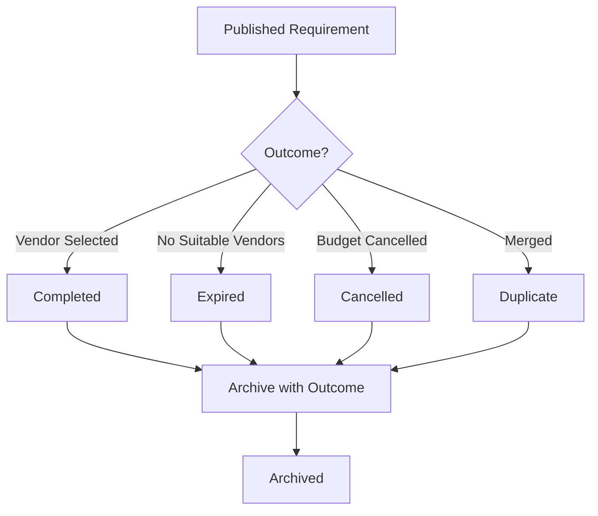

# Requirements Archived API Documentation

## Table of Contents
1. [Quick Start](#quick-start)
2. [API Endpoints](#api-endpoints)
3. [Data Models](#data-models)
4. [Business Rules & Logic](#business-rules--logic)
5. [Filtering & Sorting](#filtering--sorting)
6. [Permissions & Authorization](#permissions--authorization)
7. [UI Integration Guide](#ui-integration-guide)
8. [Error Handling](#error-handling)
9. [Testing Examples](#testing-examples)
10. [Appendix](#appendix)

---

## Quick Start

The Requirements Archived API manages completed, cancelled, or expired requirements that have been archived for historical reference and compliance purposes. This API enables:

- Viewing all archived requirements
- Recording final outcomes and completion data
- Comparing estimated vs actual costs
- Restoring archived requirements
- Exporting archive data
- Analyzing historical performance

**Key Use Cases:**
- Compliance and audit trail maintenance
- Historical cost analysis
- Vendor performance tracking
- Learning from past procurements
- Budget forecasting based on historical data
- Restore requirements for re-issue

**Archive Reasons:**


**Related Documentation:**
- [Requirements Published API](./requirements-published-api.md) - Before archiving
- [Purchase Order API](./purchase-order-api.md) - Completion records
- [Vendor Performance API](./vendor-performance-api.md) - Historical analysis

---

## API Endpoints

### 1. List Archived Requirements

Retrieve all archived requirements with filtering and search capabilities.

**Endpoint:** `GET /api/industry/requirements/archived`

**Query Parameters:**
```typescript
{
  page?: number;                    // Default: 1
  pageSize?: number;                // Default: 10, Max: 100
  sortBy?: string;                  // 'archivedDate' | 'completedDate' | 'finalValue'
  sortOrder?: string;               // 'asc' | 'desc'
  category?: string;                // Filter by category
  priority?: string;                // Filter by priority
  status?: string;                  // 'completed' | 'cancelled' | 'expired' | 'duplicate'
  dateFrom?: string;                // ISO date
  dateTo?: string;                  // ISO date
  minValue?: number;                // Min final value
  maxValue?: number;                // Max final value
  selectedVendor?: string;          // Vendor ID
  submittedBy?: string;             // User ID
  searchTerm?: string;              // Search title, description
}
```

**Request Example:**
```bash
curl -X GET 'https://api.Diligence.ai/api/industry/requirements/archived?page=1&pageSize=10&status=completed' \
  -H 'Authorization: Bearer <token>' \
  -H 'Content-Type: application/json'
```

**Response (200 OK):**
```json
{
  "success": true,
  "data": [
    {
      "id": "req_archived_abc123",
      "requirementId": "REQ-001",
      "title": "Software Development Services",
      "category": "IT Services",
      "priority": "High",
      "estimatedValue": "$50,000",
      "estimatedValueRaw": 50000,
      "finalValue": "$48,500",
      "finalValueRaw": 48500,
      "variance": "-3.0%",
      "varianceAmount": -1500,
      "archivedDate": "2024-06-15T10:00:00Z",
      "completedDate": "2024-06-10T14:30:00Z",
      "status": "completed",
      "reason": "Project Completed Successfully",
      "selectedVendor": {
        "id": "vendor_123",
        "name": "TechSoft Solutions",
        "rating": 4.8
      },
      "submittedBy": {
        "id": "user_123",
        "name": "John Doe",
        "department": "Engineering"
      },
      "duration": "6 months",
      "satisfactionRating": 5,
      "canRestore": true,
      "hasOutcomeReport": true
    }
  ],
  "pagination": {
    "currentPage": 1,
    "pageSize": 10,
    "totalItems": 125,
    "totalPages": 13,
    "hasNextPage": true,
    "hasPreviousPage": false
  },
  "summary": {
    "totalArchived": 125,
    "completed": 98,
    "cancelled": 20,
    "expired": 7,
    "totalValueCompleted": "$4,850,000",
    "averageSavings": "-2.5%",
    "averageSatisfactionRating": 4.6
  }
}
```

---

### 2. Get Archived Requirement Details

Retrieve comprehensive details of a specific archived requirement including outcome report.

**Endpoint:** `GET /api/industry/requirements/:requirementId`

**Request Example:**
```bash
curl -X GET 'https://api.Diligence.ai/api/industry/requirements/req_archived_abc123' \
  -H 'Authorization: Bearer <token>'
```

**Response (200 OK):**
```json
{
  "success": true,
  "data": {
    "id": "req_archived_abc123",
    "requirementId": "REQ-001",
    "title": "Software Development Services",
    "description": "Custom CRM system development...",
    "category": "IT Services",
    "priority": "High",
    "estimatedValue": {
      "amount": 50000,
      "currency": "USD",
      "formatted": "$50,000"
    },
    "finalValue": {
      "amount": 48500,
      "currency": "USD",
      "formatted": "$48,500"
    },
    "costVariance": {
      "amount": -1500,
      "percentage": -3.0,
      "type": "under_budget"
    },
    "timeline": {
      "submittedDate": "2024-01-15T10:00:00Z",
      "approvedDate": "2024-01-20T14:30:00Z",
      "publishedDate": "2024-01-21T09:00:00Z",
      "awardedDate": "2024-02-20T10:00:00Z",
      "completedDate": "2024-06-10T14:30:00Z",
      "archivedDate": "2024-06-15T10:00:00Z",
      "totalDuration": "5 months",
      "estimatedDuration": "6 months",
      "timeVariance": "-1 month"
    },
    "status": "completed",
    "archiveReason": "Project completed successfully",
    "selectedVendor": {
      "id": "vendor_123",
      "name": "TechSoft Solutions",
      "contactPerson": "Jane Smith",
      "email": "jane@techsoft.com",
      "rating": 4.8,
      "contractValue": "$48,500"
    },
    "outcomeReport": {
      "completionStatus": "100%",
      "qualityRating": 5,
      "timelyDelivery": true,
      "budgetCompliance": true,
      "satisfactionRating": 5,
      "satisfactionComments": "Excellent work. Delivered ahead of schedule with superior quality.",
      "successCriteria": {
        "met": 10,
        "total": 10,
        "details": [
          { "criterion": "Meets all functional requirements", "met": true },
          { "criterion": "Within budget", "met": true },
          { "criterion": "On-time delivery", "met": true }
        ]
      },
      "lessonsLearned": [
        "Early vendor engagement improved timeline",
        "Detailed specifications reduced change requests",
        "Regular progress reviews ensured quality"
      ],
      "wouldRecommendVendor": true,
      "wouldUseVendorAgain": true
    },
    "procurement Process": {
      "quotesReceived": 12,
      "vendorsInvited": 45,
      "shortlisted": 3,
      "evaluationScore": {
        "technical": 92,
        "commercial": 88,
        "overall": 90
      }
    },
    "documents": [
      {
        "id": "doc_123",
        "filename": "final_contract.pdf",
        "type": "Contract",
        "uploadedAt": "2024-02-20T10:00:00Z"
      },
      {
        "id": "doc_456",
        "filename": "completion_certificate.pdf",
        "type": "Completion Certificate",
        "uploadedAt": "2024-06-10T15:00:00Z"
      }
    ],
    "permissions": {
      "canRestore": true,
      "canExport": true,
      "canDelete": false
    }
  }
}
```

---

### 3. Archive Requirement

Move a requirement to the archive with outcome details.

**Endpoint:** `POST /api/industry/requirements/:requirementId/archive`

**Request Body:**
```json
{
  "status": "completed",
  "reason": "Project completed successfully",
  "outcomeData": {
    "selectedVendor": {
      "vendorId": "vendor_123",
      "contractValue": 48500,
      "contractDate": "2024-02-20"
    },
    "completion": {
      "completedDate": "2024-06-10",
      "completionStatus": "100%",
      "qualityRating": 5,
      "timelyDelivery": true,
      "budgetCompliance": true
    },
    "satisfaction": {
      "rating": 5,
      "comments": "Excellent work. Delivered ahead of schedule.",
      "wouldRecommendVendor": true,
      "wouldUseVendorAgain": true
    },
    "successCriteria": [
      {
        "criterion": "Meets all functional requirements",
        "met": true
      }
    ],
    "lessonsLearned": [
      "Early vendor engagement improved timeline"
    ]
  },
  "documents": ["doc_123", "doc_456"]
}
```

**Archive Status Options:**
- `completed` - Requirement fulfilled successfully
- `cancelled` - Requirement cancelled (budget, priorities changed)
- `expired` - Deadline passed with no suitable responses
- `duplicate` - Merged with another requirement

**Response (200 OK):**
```json
{
  "success": true,
  "message": "Requirement archived successfully",
  "data": {
    "requirementId": "req_abc123",
    "archivedAt": "2024-06-15T10:00:00Z",
    "archivedBy": {
      "id": "user_123",
      "name": "John Doe"
    },
    "status": "completed",
    "retentionPeriod": "7 years",
    "retentionExpiresAt": "2031-06-15T10:00:00Z",
    "archiveLocation": "cold_storage",
    "archiveId": "arch_xyz789"
  }
}
```

---

### 4. Restore Requirement

Restore an archived requirement to re-issue it.

**Endpoint:** `POST /api/industry/requirements/:requirementId/restore`

**Request Body:**
```json
{
  "reason": "Need to re-issue similar requirement",
  "createNewDraft": true,
  "copySettings": {
    "includeSpecifications": true,
    "includeDocuments": true,
    "includeApprovalWorkflow": false
  },
  "modifications": {
    "title": "Software Development Services - Phase 2",
    "estimatedValue": 55000
  }
}
```

**Response (200 OK):**
```json
{
  "success": true,
  "message": "Requirement restored successfully",
  "data": {
    "originalRequirementId": "req_archived_abc123",
    "newDraftId": "draft_new_789",
    "newRequirementId": null,
    "restoredAt": "2024-07-01T10:00:00Z",
    "restoredBy": {
      "id": "user_123",
      "name": "John Doe"
    },
    "status": "draft",
    "redirectUrl": "/dashboard/create-requirement?draftId=draft_new_789"
  }
}
```

---

### 5. Get Outcome Report

Retrieve detailed outcome report for a completed requirement.

**Endpoint:** `GET /api/industry/requirements/:requirementId/outcome`

**Request Example:**
```bash
curl -X GET 'https://api.Diligence.ai/api/industry/requirements/req_archived_abc123/outcome' \
  -H 'Authorization: Bearer <token>'
```

**Response (200 OK):**
```json
{
  "success": true,
  "data": {
    "requirementId": "req_archived_abc123",
    "title": "Software Development Services",
    "outcome": {
      "status": "completed",
      "completedDate": "2024-06-10T14:30:00Z",
      "selectedVendor": {
        "id": "vendor_123",
        "name": "TechSoft Solutions",
        "contractValue": "$48,500"
      },
      "costAnalysis": {
        "estimated": "$50,000",
        "actual": "$48,500",
        "variance": "-$1,500",
        "variancePercentage": -3.0,
        "savings": "$1,500",
        "breakdown": {
          "contractValue": "$48,500",
          "changeOrders": "$0",
          "penalties": "$0",
          "bonuses": "$0"
        }
      },
      "timelineAnalysis": {
        "estimatedDuration": "6 months",
        "actualDuration": "5 months",
        "variance": "-1 month",
        "onTimeDelivery": true,
        "milestones": [
          {
            "name": "Design Phase",
            "planned": "2024-03-15",
            "actual": "2024-03-10",
            "status": "completed_early"
          }
        ]
      },
      "qualityMetrics": {
        "overallQuality": 5,
        "specifications Met": "100%",
        "defectRate": "0.5%",
        "reworkRequired": false
      },
      "satisfaction": {
        "overallRating": 5,
        "communication": 5,
        "technical Capability": 5,
        "responsiveness": 5,
        "valueForMoney": 5,
        "comments": "Excellent work throughout the project."
      },
      "successCriteria": {
        "totalCriteria": 10,
        "criteriaМет": 10,
        "successRate": "100%"
      },
      "lessonsLearned": [
        "Early vendor engagement improved timeline",
        "Detailed specifications reduced change requests"
      ],
      "recommendations": {
        "useVendorAgain": true,
        "recommendToOthers": true,
        "improvementAreas": []
      }
    },
    "procurement Metrics": {
      "timeToAward": "30 days",
      "quotesReceived": 12,
      "competitionLevel": "high",
      "negotiationRounds": 2,
      "costReduction": "3.0%"
    },
    "complianceStatus": {
      "policyCompliance": true,
      "budgetApproval": true,
      "contractSigned": true,
      "allDocumentsArchived": true
    }
  }
}
```

---

### 6. Export Archive Data

Export archived requirements data in various formats.

**Endpoint:** `POST /api/industry/requirements/archived/export`

**Request Body:**
```json
{
  "format": "xlsx",
  "filters": {
    "status": "completed",
    "dateFrom": "2024-01-01",
    "dateTo": "2024-12-31"
  },
  "includeFields": [
    "requirementId",
    "title",
    "category",
    "estimatedValue",
    "finalValue",
    "variance",
    "selectedVendor",
    "satisfactionRating",
    "completedDate"
  ],
  "includeOutcomeReports": true
}
```

**Format Options:**
- `xlsx` - Excel spreadsheet
- `csv` - Comma-separated values
- `pdf` - PDF report
- `json` - JSON data

**Response (200 OK):**
```json
{
  "success": true,
  "message": "Export generated successfully",
  "data": {
    "exportId": "export_123",
    "format": "xlsx",
    "filename": "archived_requirements_2024.xlsx",
    "fileSize": 2560000,
    "recordsIncluded": 98,
    "generatedAt": "2024-07-01T10:00:00Z",
    "downloadUrl": "https://storage.Diligence.ai/exports/export_123.xlsx",
    "expiresAt": "2024-07-08T10:00:00Z"
  }
}
```

---

### 7. Compare Requirements

Compare multiple archived requirements for analysis.

**Endpoint:** `POST /api/industry/requirements/archived/compare`

**Request Body:**
```json
{
  "requirementIds": ["req_arch_1", "req_arch_2", "req_arch_3"],
  "compareFields": [
    "estimatedValue",
    "finalValue",
    "variance",
    "duration",
    "satisfactionRating",
    "vendorPerformance"
  ]
}
```

**Response (200 OK):**
```json
{
  "success": true,
  "data": {
    "comparison": [
      {
        "requirementId": "REQ-001",
        "title": "Software Development Services",
        "estimatedValue": "$50,000",
        "finalValue": "$48,500",
        "variance": "-3.0%",
        "duration": "5 months",
        "satisfactionRating": 5
      },
      {
        "requirementId": "REQ-002",
        "title": "Website Redesign",
        "estimatedValue": "$25,000",
        "finalValue": "$27,000",
        "variance": "+8.0%",
        "duration": "3 months",
        "satisfactionRating": 4
      }
    ],
    "insights": {
      "averageVariance": "+2.5%",
      "averageSatisfaction": 4.5,
      "bestPerformer": "REQ-001",
      "commonLessonsLearned": [
        "Early vendor engagement is crucial"
      ]
    }
  }
}
```

---

## Data Models

### ArchivedRequirement

```typescript
interface ArchivedRequirement {
  id: string;
  requirementId: string;                      // Display ID
  title: string;
  category: string;
  priority: string;
  estimatedValue: string;
  estimatedValueRaw: number;
  finalValue: string;
  finalValueRaw: number;
  variance: string;                           // "-3.0%" or "+5.0%"
  varianceAmount: number;
  archivedDate: string;                       // ISO 8601
  completedDate?: string;                     // ISO 8601 (if completed)
  status: 'completed' | 'cancelled' | 'expired' | 'duplicate';
  reason: string;
  selectedVendor?: {
    id: string;
    name: string;
    rating: number;
  };
  submittedBy: {
    id: string;
    name: string;
    department: string;
  };
  duration?: string;
  satisfactionRating?: number;                // 1-5
  canRestore: boolean;
  hasOutcomeReport: boolean;
}
```

### OutcomeReport

```typescript
interface OutcomeReport {
  requirementId: string;
  completionStatus: string;                   // "100%", "Cancelled", etc.
  qualityRating: number;                      // 1-5
  timelyDelivery: boolean;
  budgetCompliance: boolean;
  satisfactionRating: number;                 // 1-5
  satisfactionComments: string;
  successCriteria: {
    met: number;
    total: number;
    details: Array<{
      criterion: string;
      met: boolean;
    }>;
  };
  lessonsLearned: string[];
  wouldRecommendVendor: boolean;
  wouldUseVendorAgain: boolean;
  costVariance: {
    amount: number;
    percentage: number;
    type: 'under_budget' | 'over_budget' | 'on_budget';
  };
  timeVariance: {
    amount: string;                           // "- 1 month", "+2 weeks"
    percentage: number;
  };
}
```

### ArchiveRequest

```typescript
interface ArchiveRequest {
  status: 'completed' | 'cancelled' | 'expired' | 'duplicate';
  reason: string;
  outcomeData?: {
    selectedVendor?: {
      vendorId: string;
      contractValue: number;
      contractDate: string;
    };
    completion?: {
      completedDate: string;
      completionStatus: string;
      qualityRating: number;
      timelyDelivery: boolean;
      budgetCompliance: boolean;
    };
    satisfaction?: {
      rating: number;
      comments: string;
      wouldRecommendVendor: boolean;
      wouldUseVendorAgain: boolean;
    };
    successCriteria?: Array<{
      criterion: string;
      met: boolean;
    }>;
    lessonsLearned?: string[];
  };
  documents?: string[];                       // Document IDs
}
```

---

## Business Rules & Logic

### Archive Trigger Conditions

Requirements are automatically or manually archived when:

| Condition | Auto/Manual | Retention |
|-----------|-------------|-----------|
| Purchase order completed | Manual | 7 years |
| Cancelled by user | Manual | 3 years |
| Submission deadline passed with no quotes | Auto | 2 years |
| Merged into another requirement | Manual | 2 years |

### Data Retention Policy

- **Completed Requirements:** 7 years (legal/compliance)
- **Cancelled Requirements:** 3 years
- **Expired Requirements:** 2 years
- **After Retention:** Soft delete (anonymized backup for analytics)

### Cost Variance Classification

```typescript
function classifyVariance(estimated: number, actual: number): string {
  const variance = ((actual - estimated) / estimated) * 100;
  
  if (Math.abs(variance) <= 5) return 'on_budget';
  if (variance < 0) return 'under_budget';
  return 'over_budget';
}

function getVarianceRating(variance: number): string {
  if (variance <= -10) return 'excellent';        // >10% under budget
  if (variance <= -5) return 'good';              // 5-10% under
  if (variance <= 5) return 'acceptable';         // Within 5%
  if (variance <= 15) return 'concerning';        // 5-15% over
  return 'critical';                              // >15% over
}
```

### Restore Conditions

Can restore if:
- User has appropriate permissions
- Original requirement data is complete
- Not past retention expiration date
- No active duplicate requirement exists

Cannot restore if:
- Retention period expired (data purged)
- User lacks permissions
- Duplicate requirement already active

### Compliance Requirements

All archived requirements must include:
- ✅ Original requirement details
- ✅ Approval chain history
- ✅ Selected vendor information (if applicable)
- ✅ Final contract value
- ✅ All related documents
- ✅ Audit trail
- ✅ Archive reason and date

Missing any required field prevents archiving.

---

## Filtering & Sorting

### Available Filters

| Filter | Type | Options |
|--------|------|---------|
| status | string | completed, cancelled, expired, duplicate |
| category | string | Any category |
| priority | string | Critical, High, Medium, Low |
| selectedVendor | string | Vendor ID |
| submittedBy | string | User ID |
| dateFrom/dateTo | date | ISO 8601 |
| minValue/maxValue | number | Final value range |
| satisfactionRating | number | 1-5 |
| varianceType | string | under_budget, on_budget, over_budget |

### Sort Options

| Field | Description |
|-------|-------------|
| archivedDate | Most recently archived |
| completedDate | Most recently completed |
| finalValue | Highest value |
| variance | Best savings first |
| satisfactionRating | Highest rated |

### Pre-Built Views

**Successful Projects:**
```
status=completed&satisfactionRating>=4&varianceType=under_budget
```

**Cost Overruns:**
```
varianceType=over_budget&sortBy=variance&sortOrder=desc
```

**Recently Archived:**
```
sortBy=archivedDate&sortOrder=desc&dateFrom=2024-01-01
```

---

## UI Integration Guide

### Archived Requirements Table

```typescript
// src/pages/RequirementsArchived.tsx
const RequirementsArchived = () => {
  const [requirements, setRequirements] = useState([]);

  useEffect(() => {
    loadArchivedRequirements();
  }, []);

  const loadArchivedRequirements = async () => {
    const response = await requirementsListService.getArchivedRequirements({
      page: 1,
      pageSize: 10,
      sortBy: 'archivedDate',
      sortOrder: 'desc'
    });
    setRequirements(response.data);
  };

  const handleViewOutcome = async (requirementId: string) => {
    const outcome = await requirementsListService.getOutcomeReport(requirementId);
    showOutcomeModal(outcome);
  };

  const handleRestore = async (requirementId: string) => {
    const confirmed = await showConfirmDialog({
      title: 'Restore Requirement',
      message: 'This will create a new draft based on this archived requirement. Continue?'
    });

    if (confirmed) {
      const result = await requirementsListService.restoreRequirement(requirementId, {
        reason: 'Re-issue similar requirement',
        createNewDraft: true
      });
      navigate(result.redirectUrl);
    }
  };

  return (
    <CustomTable
      columns={columns}
      data={requirements}
      actions={[
        {
          label: 'View Outcome',
          onClick: (row) => handleViewOutcome(row.id),
          disabled: (row) => !row.hasOutcomeReport
        },
        {
          label: 'Restore',
          onClick: (row) => handleRestore(row.id),
          disabled: (row) => !row.canRestore
        }
      ]}
    />
  );
};
```

### Outcome Report Modal

```typescript
const OutcomeReportModal = ({ outcome, onClose }) => {
  return (
    <Dialog open onOpenChange={onClose}>
      <DialogContent className="max-w-4xl max-h-[80vh] overflow-y-auto">
        <DialogHeader>
          <DialogTitle>Outcome Report - {outcome.requirementId}</DialogTitle>
        </DialogHeader>

        <div className="space-y-6">
          {/* Cost Analysis */}
          <Card>
            <CardHeader>
              <CardTitle>Cost Analysis</CardTitle>
            </CardHeader>
            <CardContent>
              <div className="grid grid-cols-3 gap-4">
                <MetricCard title="Estimated" value={outcome.costAnalysis.estimated} />
                <MetricCard title="Actual" value={outcome.costAnalysis.actual} />
                <MetricCard
                  title="Variance"
                  value={outcome.costAnalysis.variance}
                  variant={outcome.costVariance.type === 'under_budget' ? 'success' : 'danger'}
                />
              </div>
            </CardContent>
          </Card>

          {/* Quality & Satisfaction */}
          <Card>
            <CardHeader>
              <CardTitle>Quality & Satisfaction</CardTitle>
            </CardHeader>
            <CardContent>
              <div className="space-y-4">
                <div>
                  <Label>Overall Rating</Label>
                  <StarRating value={outcome.satisfaction.overallRating} readonly />
                </div>
                <div>
                  <Label>Comments</Label>
                  <p className="text-sm">{outcome.satisfaction.comments}</p>
                </div>
              </div>
            </CardContent>
          </Card>

          {/* Lessons Learned */}
          <Card>
            <CardHeader>
              <CardTitle>Lessons Learned</CardTitle>
            </CardHeader>
            <CardContent>
              <ul className="list-disc pl-5 space-y-2">
                {outcome.lessonsLearned.map((lesson, i) => (
                  <li key={i} className="text-sm">{lesson}</li>
                ))}
              </ul>
            </CardContent>
          </Card>
        </div>

        <DialogFooter>
          <Button variant="outline" onClick={onClose}>Close</Button>
          <Button onClick={() => exportOutcomeReport(outcome.requirementId)}>
            Export PDF
          </Button>
        </DialogFooter>
      </DialogContent>
    </Dialog>
  );
};
```

### Cost Variance Badge

```typescript
const CostVarianceBadge = ({ variance, varianceAmount }) => {
  const getVariant = () => {
    const percent = parseFloat(variance);
    if (percent <= -5) return 'success';        // Under budget
    if (percent >= 5) return 'destructive';     // Over budget
    return 'secondary';                         // On budget
  };

  return (
    <Badge variant={getVariant()}>
      {variance} ({varianceAmount < 0 ? 'Saved' : 'Over'} {Math.abs(varianceAmount).toLocaleString()})
    </Badge>
  );
};
```

---

## Testing Examples

### cURL Examples

**1. List Archived Requirements:**
```bash
curl -X GET 'https://api.Diligence.ai/api/industry/requirements/archived?status=completed' \
  -H 'Authorization: Bearer <token>'
```

**2. Archive Requirement:**
```bash
curl -X POST 'https://api.Diligence.ai/api/industry/requirements/req_abc123/archive' \
  -H 'Authorization: Bearer <token>' \
  -H 'Content-Type: application/json' \
  -d '{
    "status": "completed",
    "reason": "Project completed successfully",
    "outcomeData": {
      "selectedVendor": {
        "vendorId": "vendor_123",
        "contractValue": 48500
      }
    }
  }'
```

**3. Restore Requirement:**
```bash
curl -X POST 'https://api.Diligence.ai/api/industry/requirements/req_archived_abc123/restore' \
  -H 'Authorization: Bearer <token>' \
  -H 'Content-Type: application/json' \
  -d '{
    "reason": "Re-issue requirement",
    "createNewDraft": true
  }'
```

---

## Appendix

### Related Documentation
- [Requirements Published API](./requirements-published-api.md)
- [Purchase Order API](./purchase-order-api.md)
- [Historical Analytics API](./analytics-historical-api.md)

---

**Last Updated:** 2024-01-20  
**API Version:** 1.0.0  
**Author:** Diligence.ai Backend Team
