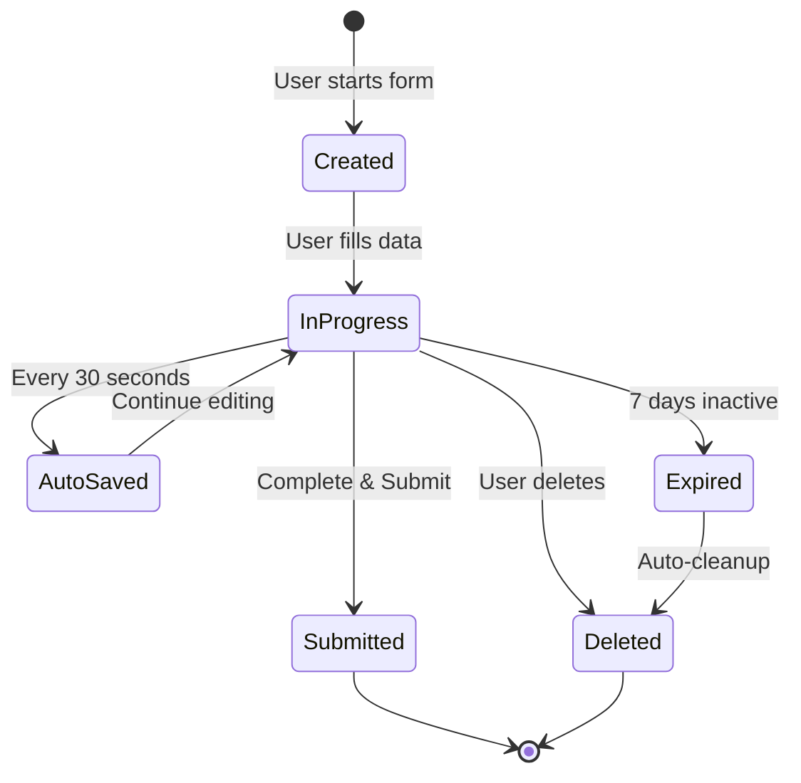

# Requirements Drafts API Documentation

## Table of Contents
1. [Quick Start](#quick-start)
2. [API Endpoints](#api-endpoints)
3. [Data Models](#data-models)
4. [Business Rules & Logic](#business-rules--logic)
5. [Filtering & Sorting](#filtering--sorting)
6. [Permissions & Authorization](#permissions--authorization)
7. [UI Integration Guide](#ui-integration-guide)
8. [Error Handling](#error-handling)
9. [Testing Examples](#testing-examples)
10. [Appendix](#appendix)

---

## Quick Start

The Requirements Drafts API allows Industry users to manage incomplete requirement submissions that are saved for later completion. Drafts enable users to:

- Save progress while creating complex requirements
- Resume editing at any time
- Delete unwanted drafts
- View all saved drafts with filtering and sorting
- Recover from session interruptions

**Key Use Cases:**
- User starts creating a requirement but needs to gather more information
- User wants to create multiple requirements over time
- User's session expires and needs to recover work
- User wants to review all incomplete requirements

**Related Documentation:**
- [Create Requirement API](./create-requirement-api.md) - For completing and submitting drafts

---

## API Endpoints

### 1. List All Drafts

Retrieve all draft requirements for the authenticated user with pagination, filtering, and sorting.

**Endpoint:** `GET /api/industry/requirements/drafts`

**Query Parameters:**
```typescript
{
  page?: number;           // Default: 1
  pageSize?: number;       // Default: 10, Max: 100
  sortBy?: string;         // 'lastModified' | 'createdDate' | 'title' | 'category' | 'priority'
  sortOrder?: string;      // 'asc' | 'desc', Default: 'desc'
  category?: string;       // Filter by category
  priority?: string;       // Filter by priority
  searchTerm?: string;     // Search in title
  dateFrom?: string;       // ISO date string
  dateTo?: string;         // ISO date string
}
```

**Request Example:**
```bash
curl -X GET 'https://api.Diligence.ai/api/industry/requirements/drafts?page=1&pageSize=10&sortBy=lastModified&sortOrder=desc' \
  -H 'Authorization: Bearer <token>' \
  -H 'Content-Type: application/json'
```

**Response (200 OK):**
```json
{
  "success": true,
  "data": [
    {
      "id": "draft_abc123",
      "title": "Software Development Services",
      "category": "IT Services",
      "priority": "High",
      "estimatedValue": "$50,000",
      "createdDate": "2024-01-15T10:30:00Z",
      "lastModified": "2024-01-20T15:45:00Z",
      "status": "Draft",
      "completionPercentage": 65,
      "currentStep": 3,
      "totalSteps": 5,
      "expiresAt": "2024-01-27T15:45:00Z",
      "isExpiringSoon": false
    }
  ],
  "pagination": {
    "currentPage": 1,
    "pageSize": 10,
    "totalItems": 25,
    "totalPages": 3,
    "hasNextPage": true,
    "hasPreviousPage": false
  },
  "filters": {
    "appliedFilters": {
      "sortBy": "lastModified",
      "sortOrder": "desc"
    }
  }
}
```

---

### 2. Get Draft Details

Retrieve full details of a specific draft for resuming editing.

**Endpoint:** `GET /api/industry/requirements/draft/:draftId`

**Path Parameters:**
- `draftId` (string, required) - The unique draft identifier

**Request Example:**
```bash
curl -X GET 'https://api.Diligence.ai/api/industry/requirements/draft/draft_abc123' \
  -H 'Authorization: Bearer <token>' \
  -H 'Content-Type: application/json'
```

**Response (200 OK):**
```json
{
  "success": true,
  "data": {
    "id": "draft_abc123",
    "metadata": {
      "createdAt": "2024-01-15T10:30:00Z",
      "updatedAt": "2024-01-20T15:45:00Z",
      "expiresAt": "2024-01-27T15:45:00Z",
      "currentStep": 3,
      "totalSteps": 5,
      "completionPercentage": 65,
      "version": 5
    },
    "formData": {
      "step1": {
        "title": "Software Development Services",
        "category": "IT Services",
        "subcategory": "Custom Software Development",
        "description": "Need a custom CRM system...",
        "priority": "High"
      },
      "step2": {
        "requirementType": "Technical",
        "specifications": ["REQ-001", "REQ-002"],
        "technicalDetails": "..."
      },
      "step3": {
        "estimatedBudget": 50000,
        "currency": "USD",
        "budgetRange": "25000-75000"
      },
      "step4": null,
      "step5": null
    },
    "documents": [
      {
        "id": "doc_123",
        "filename": "requirements.pdf",
        "fileSize": 256000,
        "fileType": "application/pdf",
        "documentType": "Technical Specification",
        "uploadedAt": "2024-01-15T11:00:00Z",
        "url": "https://storage.Diligence.ai/documents/doc_123"
      }
    ]
  }
}
```

---

### 3. Delete Draft

Delete a specific draft permanently.

**Endpoint:** `DELETE /api/industry/requirements/draft/:draftId`

**Path Parameters:**
- `draftId` (string, required) - The unique draft identifier

**Request Example:**
```bash
curl -X DELETE 'https://api.Diligence.ai/api/industry/requirements/draft/draft_abc123' \
  -H 'Authorization: Bearer <token>' \
  -H 'Content-Type: application/json'
```

**Response (200 OK):**
```json
{
  "success": true,
  "message": "Draft deleted successfully",
  "deletedDraftId": "draft_abc123"
}
```

---

### 4. Resume Draft

Mark a draft as "in progress" and return to the create requirement flow.

**Endpoint:** `POST /api/industry/requirements/draft/:draftId/resume`

**Path Parameters:**
- `draftId` (string, required) - The unique draft identifier

**Request Example:**
```bash
curl -X POST 'https://api.Diligence.ai/api/industry/requirements/draft/draft_abc123/resume' \
  -H 'Authorization: Bearer <token>' \
  -H 'Content-Type: application/json'
```

**Response (200 OK):**
```json
{
  "success": true,
  "message": "Draft resumed successfully",
  "data": {
    "draftId": "draft_abc123",
    "redirectUrl": "/dashboard/create-requirement?draftId=draft_abc123",
    "currentStep": 3,
    "formData": { /* ... full form data ... */ }
  }
}
```

---

### 5. Bulk Delete Drafts

Delete multiple drafts at once.

**Endpoint:** `POST /api/industry/requirements/drafts/bulk-delete`

**Request Body:**
```json
{
  "draftIds": ["draft_abc123", "draft_def456", "draft_ghi789"]
}
```

**Request Example:**
```bash
curl -X POST 'https://api.Diligence.ai/api/industry/requirements/drafts/bulk-delete' \
  -H 'Authorization: Bearer <token>' \
  -H 'Content-Type: application/json' \
  -d '{"draftIds": ["draft_abc123", "draft_def456"]}'
```

**Response (200 OK):**
```json
{
  "success": true,
  "message": "3 drafts deleted successfully",
  "deletedCount": 3,
  "failedCount": 0,
  "results": [
    {
      "draftId": "draft_abc123",
      "status": "deleted"
    },
    {
      "draftId": "draft_def456",
      "status": "deleted"
    },
    {
      "draftId": "draft_ghi789",
      "status": "deleted"
    }
  ]
}
```

---

## Data Models

### DraftListItem

Summary information for displaying drafts in a table.

```typescript
interface DraftListItem {
  id: string;                      // Unique draft identifier
  title: string;                   // Requirement title
  category: string;                // Category name
  priority: string;                // 'Critical' | 'High' | 'Medium' | 'Low'
  estimatedValue: string;          // Formatted currency string
  createdDate: string;             // ISO 8601 datetime
  lastModified: string;            // ISO 8601 datetime
  status: 'Draft';                 // Always 'Draft' for this list
  completionPercentage: number;    // 0-100
  currentStep: number;             // Current step in form (1-5)
  totalSteps: number;              // Total steps (always 5)
  expiresAt: string;               // ISO 8601 datetime
  isExpiringSoon: boolean;         // True if expires within 24 hours
}
```

### DraftDetailResponse

Complete draft data including all form fields.

```typescript
interface DraftDetailResponse {
  id: string;
  metadata: DraftMetadata;
  formData: {
    step1: Step1Data | null;
    step2: Step2Data | null;
    step3: Step3Data | null;
    step4: Step4Data | null;
    step5: Step5Data | null;
  };
  documents: DocumentInfo[];
}

interface DraftMetadata {
  createdAt: string;               // ISO 8601 datetime
  updatedAt: string;               // ISO 8601 datetime
  expiresAt: string;               // ISO 8601 datetime
  currentStep: number;             // 1-5
  totalSteps: number;              // Always 5
  completionPercentage: number;    // 0-100
  version: number;                 // Optimistic locking version
}

interface DocumentInfo {
  id: string;
  filename: string;
  fileSize: number;                // Bytes
  fileType: string;                // MIME type
  documentType: string;            // Document category
  uploadedAt: string;              // ISO 8601 datetime
  url: string;                     // Signed URL for download
}
```

### PaginationParams

Query parameters for list endpoints.

```typescript
interface PaginationParams {
  page?: number;
  pageSize?: number;
  sortBy?: 'lastModified' | 'createdDate' | 'title' | 'category' | 'priority';
  sortOrder?: 'asc' | 'desc';
  category?: string;
  priority?: string;
  searchTerm?: string;
  dateFrom?: string;
  dateTo?: string;
}
```

### DraftListResponse

Response wrapper for list endpoint.

```typescript
interface DraftListResponse {
  success: boolean;
  data: DraftListItem[];
  pagination: {
    currentPage: number;
    pageSize: number;
    totalItems: number;
    totalPages: number;
    hasNextPage: boolean;
    hasPreviousPage: boolean;
  };
  filters: {
    appliedFilters: Record<string, any>;
  };
}
```

---

## Business Rules & Logic

### Draft Lifecycle



### Auto-Save Behavior

1. **Frequency:** Drafts auto-save every 30 seconds while user is editing
2. **Trigger Events:**
   - User moves to next/previous step
   - User closes browser tab
   - User navigates away
   - Network connectivity restored
3. **Conflict Resolution:**
   - Use optimistic locking with version numbers
   - If version mismatch, prompt user to resolve conflict
   - Always preserve user's local changes

### Expiration Rules

1. **Default Expiration:** 7 days from last modification
2. **Warning Threshold:** Show warning when < 24 hours remaining
3. **Grace Period:** 24 hours after expiration before auto-delete
4. **Notification:**
   - Email at 1 day before expiration
   - In-app notification at 1 hour before expiration
5. **Extension:** User can extend expiration by resuming draft

### Completion Calculation

```typescript
function calculateCompletion(formData: any): number {
  const requiredFields = {
    step1: ['title', 'category', 'description'],
    step2: ['requirementType', 'specifications'],
    step3: ['estimatedBudget', 'currency'],
    step4: ['deliveryAddress', 'timeline'],
    step5: ['approvers', 'termsAccepted']
  };
  
  let completedFields = 0;
  let totalFields = 0;
  
  for (const [step, fields] of Object.entries(requiredFields)) {
    totalFields += fields.length;
    if (formData[step]) {
      completedFields += fields.filter(f => formData[step][f]).length;
    }
  }
  
  return Math.round((completedFields / totalFields) * 100);
}
```

### Storage Optimization

1. **Data Compression:** Compress large text fields before storage
2. **Document Limits:**
   - Max 10 documents per draft
   - Max 50MB total size per draft
3. **Cleanup Policy:**
   - Delete expired drafts after 30 days
   - Delete orphaned documents immediately
4. **Archive:** Move old drafts to cold storage after 90 days

---

## Filtering & Sorting

### Available Filters

| Filter | Type | Options | Default |
|--------|------|---------|---------|
| category | string | Any category from master list | All |
| priority | string | Critical, High, Medium, Low | All |
| searchTerm | string | Searches title field | Empty |
| dateFrom | date | ISO 8601 date | 90 days ago |
| dateTo | date | ISO 8601 date | Today |

### Sort Options

| Field | Description | Default Order |
|-------|-------------|---------------|
| lastModified | Most recently edited first | DESC |
| createdDate | Newest first | DESC |
| title | Alphabetical by title | ASC |
| category | Alphabetical by category | ASC |
| priority | Critical → Low | DESC |

### Filter Combinations

**Example 1: High priority IT Services drafts**
```
GET /api/industry/requirements/drafts?category=IT%20Services&priority=High
```

**Example 2: Expiring soon (last 24 hours)**
```
GET /api/industry/requirements/drafts?sortBy=expiresAt&sortOrder=asc
```

**Example 3: Search with date range**
```
GET /api/industry/requirements/drafts?searchTerm=software&dateFrom=2024-01-01&dateTo=2024-01-31
```

---

## Permissions & Authorization

### Role-Based Access

| Role | List Drafts | View Draft | Edit Draft | Delete Draft | Resume Draft |
|------|-------------|------------|------------|--------------|--------------|
| Industry User | ✅ Own only | ✅ Own only | ✅ Own only | ✅ Own only | ✅ Own only |
| Department Head | ✅ Team drafts | ✅ Team drafts | ❌ | ✅ Team drafts | ❌ |
| Admin | ✅ All | ✅ All | ✅ All | ✅ All | ✅ All |

### Authorization Checks

**List Drafts:**
```typescript
// Users only see their own drafts unless they have elevated permissions
if (user.role === 'Industry User') {
  query.userId = user.id;
} else if (user.role === 'Department Head') {
  query.departmentId = user.departmentId;
}
// Admins see all drafts (no filter)
```

**View/Resume Draft:**
```typescript
const draft = await Draft.findById(draftId);
if (!draft) {
  throw new NotFoundError('Draft not found');
}

if (draft.userId !== user.id && !user.hasPermission('view_all_drafts')) {
  throw new ForbiddenError('Access denied');
}
```

**Delete Draft:**
```typescript
const draft = await Draft.findById(draftId);
if (draft.userId !== user.id && !user.hasPermission('delete_any_draft')) {
  throw new ForbiddenError('Cannot delete another user\'s draft');
}
```

### Security Considerations

1. **Data Isolation:** Users can only access their own drafts by default
2. **Token Validation:** All endpoints require valid JWT token
3. **Rate Limiting:** Max 100 requests per minute per user
4. **Audit Logging:** Log all draft deletions and bulk operations
5. **XSS Prevention:** Sanitize all user input before storage

---

## UI Integration Guide

### Integrating with CustomTable Component

The drafts page uses the `CustomTable` component. Here's how to map API responses:

```typescript
// src/pages/RequirementsDrafts.tsx
import { useState, useEffect } from 'react';
import CustomTable from '@/components/CustomTable';
import { requirementsListService } from '@/services/requirements-list.service';
import { DraftListItem } from '@/types/requirements-list';

const RequirementsDrafts = () => {
  const [drafts, setDrafts] = useState<DraftListItem[]>([]);
  const [loading, setLoading] = useState(true);
  const [pagination, setPagination] = useState({
    currentPage: 1,
    pageSize: 10,
    totalItems: 0
  });

  useEffect(() => {
    loadDrafts();
  }, [pagination.currentPage]);

  const loadDrafts = async () => {
    try {
      setLoading(true);
      const response = await requirementsListService.getDrafts({
        page: pagination.currentPage,
        pageSize: pagination.pageSize,
        sortBy: 'lastModified',
        sortOrder: 'desc'
      });
      
      setDrafts(response.data);
      setPagination(prev => ({
        ...prev,
        totalItems: response.pagination.totalItems
      }));
    } catch (error) {
      console.error('Failed to load drafts:', error);
      // Show error toast
    } finally {
      setLoading(false);
    }
  };

  const handleResumeDraft = async (draftId: string) => {
    try {
      const response = await requirementsListService.resumeDraft(draftId);
      // Navigate to create requirement page with draft data
      navigate(`/dashboard/create-requirement?draftId=${draftId}`);
    } catch (error) {
      console.error('Failed to resume draft:', error);
    }
  };

  const handleDeleteDraft = async (draftId: string) => {
    try {
      await requirementsListService.deleteDraft(draftId);
      toast.success('Draft deleted successfully');
      loadDrafts(); // Reload list
    } catch (error) {
      console.error('Failed to delete draft:', error);
      toast.error('Failed to delete draft');
    }
  };

  const columns = [
    {
      name: 'id',
      label: 'Draft ID',
      isSortable: true,
      action: (row) => handleResumeDraft(row.id)
    },
    {
      name: 'title',
      label: 'Title',
      isSortable: true,
      isSearchable: true
    },
    // ... other columns
  ];

  return (
    <CustomTable
      columns={columns}
      data={drafts}
      loading={loading}
      pagination={{
        enabled: true,
        ...pagination
      }}
      onPageChange={(page) => setPagination(prev => ({ ...prev, currentPage: page }))}
    />
  );
};
```

### Resume Draft Flow

1. User clicks on draft ID or "Resume" button
2. Call `POST /api/industry/requirements/draft/:draftId/resume`
3. Navigate to `/dashboard/create-requirement?draftId={draftId}`
4. Create Requirement page loads draft data and positions user at correct step

```typescript
// In Create Requirement page
const { draftId } = useSearchParams();

useEffect(() => {
  if (draftId) {
    loadDraft(draftId);
  }
}, [draftId]);

const loadDraft = async (id: string) => {
  const draft = await requirementDraftService.getDraft(id);
  setFormData(draft.formData);
  setCurrentStep(draft.metadata.currentStep);
};
```

### Expiration Warning UI

Show visual indicators for drafts expiring soon:

```typescript
const ExpirationBadge = ({ expiresAt, isExpiringSoon }: { expiresAt: string, isExpiringSoon: boolean }) => {
  if (!isExpiringSoon) return null;
  
  const hoursRemaining = Math.floor(
    (new Date(expiresAt).getTime() - Date.now()) / (1000 * 60 * 60)
  );
  
  return (
    <Badge variant="destructive">
      Expires in {hoursRemaining}h
    </Badge>
  );
};
```

### Bulk Delete Confirmation

```typescript
const handleBulkDelete = async (selectedDrafts: string[]) => {
  const confirmed = await showConfirmDialog({
    title: 'Delete Drafts',
    message: `Are you sure you want to delete ${selectedDrafts.length} draft(s)? This action cannot be undone.`,
    confirmText: 'Delete',
    confirmVariant: 'destructive'
  });
  
  if (confirmed) {
    try {
      await requirementsListService.bulkDeleteDrafts(selectedDrafts);
      toast.success(`${selectedDrafts.length} drafts deleted successfully`);
      loadDrafts();
    } catch (error) {
      toast.error('Failed to delete drafts');
    }
  }
};
```

---

## Error Handling

### HTTP Status Codes

| Code | Meaning | Common Causes | Recovery Strategy |
|------|---------|---------------|-------------------|
| 200 | Success | Request processed | Continue normal flow |
| 400 | Bad Request | Invalid parameters | Show validation errors to user |
| 401 | Unauthorized | Invalid/expired token | Redirect to login |
| 403 | Forbidden | Insufficient permissions | Show permission denied message |
| 404 | Not Found | Draft doesn't exist | Show "Draft not found" message |
| 409 | Conflict | Version mismatch | Prompt user to reload |
| 410 | Gone | Draft expired | Show expiration notice, offer to create new |
| 429 | Rate Limited | Too many requests | Show retry message with countdown |
| 500 | Server Error | Backend issue | Show generic error, log to monitoring |

### Error Response Format

```json
{
  "success": false,
  "error": {
    "code": "DRAFT_NOT_FOUND",
    "message": "The requested draft does not exist or has been deleted",
    "details": {
      "draftId": "draft_abc123",
      "possibleReasons": [
        "Draft was deleted",
        "Draft expired and was auto-cleaned",
        "Invalid draft ID"
      ]
    },
    "timestamp": "2024-01-20T15:45:00Z",
    "requestId": "req_xyz789"
  }
}
```

### Common Error Scenarios

**1. Draft Not Found (404)**
```typescript
try {
  const draft = await getDraft(draftId);
} catch (error) {
  if (error.code === 'DRAFT_NOT_FOUND') {
    toast.error('Draft not found. It may have been deleted or expired.');
    navigate('/dashboard/requirements/drafts');
  }
}
```

**2. Draft Expired (410)**
```typescript
try {
  const draft = await resumeDraft(draftId);
} catch (error) {
  if (error.code === 'DRAFT_EXPIRED') {
    showDialog({
      title: 'Draft Expired',
      message: 'This draft has expired. Would you like to create a new requirement?',
      actions: [
        { label: 'Create New', onClick: () => navigate('/dashboard/create-requirement') },
        { label: 'Cancel', onClick: () => {} }
      ]
    });
  }
}
```

**3. Concurrent Edit Conflict (409)**
```typescript
try {
  await updateDraft(draftId, data, version);
} catch (error) {
  if (error.code === 'VERSION_CONFLICT') {
    showDialog({
      title: 'Draft Updated Elsewhere',
      message: 'This draft was modified in another session. Please reload to see the latest version.',
      actions: [
        { label: 'Reload', onClick: () => window.location.reload() },
        { label: 'Keep My Changes', onClick: () => forceSave(data) }
      ]
    });
  }
}
```

**4. Bulk Delete Partial Failure**
```typescript
const result = await bulkDeleteDrafts(draftIds);
if (result.failedCount > 0) {
  const failedIds = result.results
    .filter(r => r.status === 'failed')
    .map(r => r.draftId);
  
  toast.warning(
    `${result.deletedCount} drafts deleted, ${result.failedCount} failed`,
    {
      action: {
        label: 'View Details',
        onClick: () => showFailedDraftsDialog(failedIds)
      }
    }
  );
}
```

### Client-Side Validation

Before calling APIs, validate inputs:

```typescript
function validatePaginationParams(params: PaginationParams): string[] {
  const errors: string[] = [];
  
  if (params.page && params.page < 1) {
    errors.push('Page must be >= 1');
  }
  
  if (params.pageSize && (params.pageSize < 1 || params.pageSize > 100)) {
    errors.push('Page size must be between 1 and 100');
  }
  
  if (params.sortBy && !['lastModified', 'createdDate', 'title', 'category', 'priority'].includes(params.sortBy)) {
    errors.push('Invalid sortBy value');
  }
  
  return errors;
}
```

---

## Testing Examples

### Manual Testing with cURL

**1. List Drafts**
```bash
# Get first page of drafts
curl -X GET 'https://api.Diligence.ai/api/industry/requirements/drafts?page=1&pageSize=10' \
  -H 'Authorization: Bearer eyJhbGc...' \
  -H 'Content-Type: application/json'

# Filter by high priority
curl -X GET 'https://api.Diligence.ai/api/industry/requirements/drafts?priority=High' \
  -H 'Authorization: Bearer eyJhbGc...'

# Search by title
curl -X GET 'https://api.Diligence.ai/api/industry/requirements/drafts?searchTerm=software' \
  -H 'Authorization: Bearer eyJhbGc...'
```

**2. Get Draft Details**
```bash
curl -X GET 'https://api.Diligence.ai/api/industry/requirements/draft/draft_abc123' \
  -H 'Authorization: Bearer eyJhbGc...' \
  -H 'Content-Type: application/json'
```

**3. Resume Draft**
```bash
curl -X POST 'https://api.Diligence.ai/api/industry/requirements/draft/draft_abc123/resume' \
  -H 'Authorization: Bearer eyJhbGc...' \
  -H 'Content-Type: application/json'
```

**4. Delete Draft**
```bash
curl -X DELETE 'https://api.Diligence.ai/api/industry/requirements/draft/draft_abc123' \
  -H 'Authorization: Bearer eyJhbGc...' \
  -H 'Content-Type: application/json'
```

**5. Bulk Delete**
```bash
curl -X POST 'https://api.Diligence.ai/api/industry/requirements/drafts/bulk-delete' \
  -H 'Authorization: Bearer eyJhbGc...' \
  -H 'Content-Type: application/json' \
  -d '{
    "draftIds": ["draft_abc123", "draft_def456", "draft_ghi789"]
  }'
```

### Test Scenarios

**Scenario 1: Create and Resume Draft**
1. Start creating a requirement → Draft auto-saved
2. Close browser without submitting
3. Return to Drafts page → Verify draft appears in list
4. Click on draft → Verify redirected to correct step with data pre-filled
5. Complete and submit → Verify draft removed from list

**Scenario 2: Draft Expiration**
1. Create a draft
2. Manually set `expiresAt` to 1 hour from now (using admin tools)
3. Wait for expiration warning (or simulate time passage)
4. Verify "Expiring Soon" badge appears
5. After expiration, verify draft shows expired status
6. Attempt to resume → Verify 410 Gone error

**Scenario 3: Concurrent Editing**
1. Open same draft in two browser tabs
2. Edit and save in Tab 1
3. Edit and save in Tab 2
4. Verify version conflict error in Tab 2
5. Reload Tab 2 → Verify sees Tab 1's changes

**Scenario 4: Bulk Delete**
1. Create 5 drafts
2. Select 3 drafts using checkboxes
3. Click "Delete Selected"
4. Confirm deletion
5. Verify 3 drafts removed, 2 remain

**Scenario 5: Filtering and Sorting**
1. Create drafts with various categories and priorities
2. Apply category filter → Verify only matching drafts shown
3. Apply priority filter → Verify correct drafts shown
4. Sort by lastModified DESC → Verify most recent first
5. Search by title → Verify search works

### Automated Testing

**Unit Test Example (Jest + React Testing Library):**
```typescript
import { render, screen, waitFor } from '@testing-library/react';
import userEvent from '@testing-library/user-event';
import RequirementsDrafts from '@/pages/RequirementsDrafts';
import * as service from '@/services/requirements-list.service';

jest.mock('@/services/requirements-list.service');

describe('RequirementsDrafts Page', () => {
  it('should load and display drafts', async () => {
    const mockDrafts = [
      {
        id: 'draft_1',
        title: 'Test Draft',
        category: 'IT Services',
        priority: 'High',
        // ... other fields
      }
    ];
    
    service.getDrafts.mockResolvedValue({
      success: true,
      data: mockDrafts,
      pagination: { /* ... */ }
    });
    
    render(<RequirementsDrafts />);
    
    await waitFor(() => {
      expect(screen.getByText('Test Draft')).toBeInTheDocument();
    });
  });
  
  it('should handle draft deletion', async () => {
    const mockDrafts = [{ id: 'draft_1', /* ... */ }];
    service.getDrafts.mockResolvedValue({ data: mockDrafts, /* ... */ });
    service.deleteDraft.mockResolvedValue({ success: true });
    
    render(<RequirementsDrafts />);
    
    const deleteButton = await screen.findByLabelText('Delete draft_1');
    await userEvent.click(deleteButton);
    
    const confirmButton = await screen.findByText('Confirm');
    await userEvent.click(confirmButton);
    
    await waitFor(() => {
      expect(service.deleteDraft).toHaveBeenCalledWith('draft_1');
      expect(screen.getByText('Draft deleted successfully')).toBeInTheDocument();
    });
  });
});
```

---

## Appendix

### Related API Documentation
- [Create Requirement API](./create-requirement-api.md) - Creating and submitting requirements
- [Requirements Pending API](./requirements-pending-api.md) - Approval workflow
- [Requirements Overview API](./requirements-overview-api.md) - Dashboard and search

### API Routes Reference

From `src/services/api.routes.ts`:

```typescript
export const API_ROUTES = {
  // ... other routes
  industry: {
    requirements: {
      drafts: {
        list: '/api/industry/requirements/drafts',
        get: (draftId: string) => `/api/industry/requirements/draft/${draftId}`,
        delete: (draftId: string) => `/api/industry/requirements/draft/${draftId}`,
        resume: (draftId: string) => `/api/industry/requirements/draft/${draftId}/resume`,
        bulkDelete: '/api/industry/requirements/drafts/bulk-delete'
      }
    }
  }
};
```

### Database Schema

**Drafts Collection:**
```json
{
  "_id": "ObjectId",
  "userId": "ObjectId",
  "companyId": "ObjectId",
  "departmentId": "ObjectId",
  "metadata": {
    "createdAt": "Date",
    "updatedAt": "Date",
    "expiresAt": "Date",
    "currentStep": "Number",
    "totalSteps": "Number",
    "completionPercentage": "Number",
    "version": "Number"
  },
  "formData": {
    "step1": "Object",
    "step2": "Object",
    "step3": "Object",
    "step4": "Object",
    "step5": "Object"
  },
  "documents": ["ObjectId"],
  "status": "String"
}
```

**Indexes:**
- `userId + status` (compound index for fast user draft lookups)
- `expiresAt` (for cleanup job)
- `updatedAt` (for sorting)
- `companyId + departmentId` (for admin views)

### Performance Considerations

1. **Pagination:** Always use pagination for large result sets
2. **Caching:** Cache draft lists for 30 seconds to reduce DB load
3. **Indexing:** Ensure all filter/sort fields are indexed
4. **Lazy Loading:** Load draft details only when needed (not in list view)
5. **Compression:** Compress large formData objects before storage

### Monitoring & Metrics

Track these metrics for draft management:

- **Draft Creation Rate:** Drafts created per day/week
- **Completion Rate:** % of drafts that become published requirements
- **Abandonment Rate:** % of drafts that expire without completion
- **Average Completion Time:** Time from draft creation to submission
- **Resume Rate:** % of drafts that are resumed after initial save
- **Delete Rate:** % of drafts manually deleted by users

### Changelog

| Version | Date | Changes |
|---------|------|---------|
| 1.0.0 | 2024-01-15 | Initial draft management API |
| 1.1.0 | 2024-01-20 | Added bulk delete functionality |
| 1.2.0 | 2024-02-01 | Added expiration warnings and auto-cleanup |

---

**Last Updated:** 2024-01-20
**API Version:** 1.2.0
**Author:** Diligence.ai Backend Team
