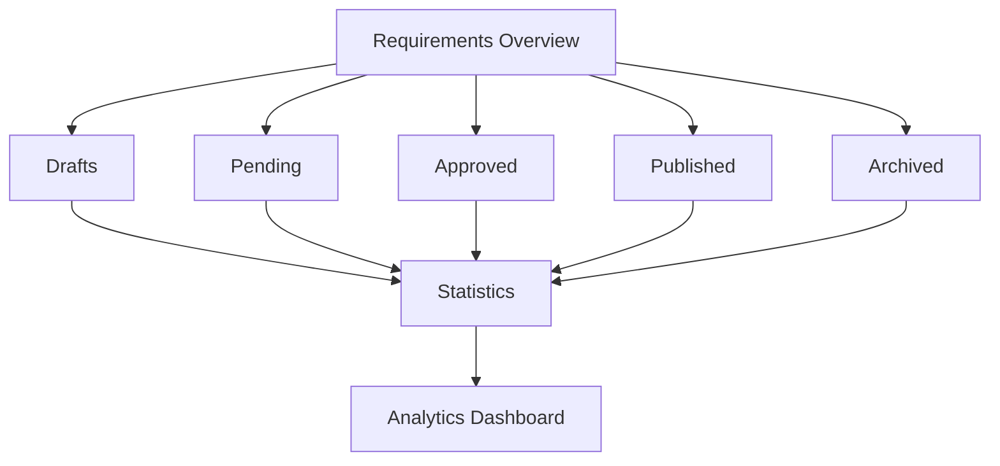

# Requirements Overview API Documentation

## Table of Contents
1. [Quick Start](#quick-start)
2. [API Endpoints](#api-endpoints)
3. [Data Models](#data-models)
4. [Business Rules & Logic](#business-rules--logic)
5. [Filtering & Sorting](#filtering--sorting)
6. [Permissions & Authorization](#permissions--authorization)
7. [UI Integration Guide](#ui-integration-guide)
8. [Error Handling](#error-handling)
9. [Testing Examples](#testing-examples)
10. [Appendix](#appendix)

---

## Quick Start

The Requirements Overview API provides a unified dashboard view of all requirements across different statuses (drafts, pending, approved, published, archived). This API enables:

- Viewing all requirements in one place with powerful filtering
- Getting summary statistics across all requirement statuses
- Searching requirements with full-text search
- Tracking recent activity and changes
- Exporting comprehensive requirement reports
- Quick navigation to specific requirement pages

**Key Use Cases:**
- Executive dashboard with high-level metrics
- Cross-status requirement search and filtering
- Department-wide requirement tracking
- Budgeting and forecasting
- Performance monitoring
- Compliance reporting

**Requirements Dashboard Overview:**


**Related Documentation:**
- [Requirements Drafts API](./requirements-drafts-api.md)
- [Requirements Pending API](./requirements-pending-api.md)
- [Requirements Approved API](./requirements-approved-api.md)
- [Requirements Published API](./requirements-published-api.md)
- [Requirements Archived API](./requirements-archived-api.md)

---

## API Endpoints

### 1. Get Requirements Summary

Retrieve summary statistics across all requirement statuses.

**Endpoint:** `GET /api/industry/requirements/stats`

**Query Parameters:**
```typescript
{
  dateFrom?: string;            // ISO date - filter by date range
  dateTo?: string;              // ISO date
  department?: string;          // Filter by department
  category?: string;            // Filter by category
}
```

**Request Example:**
```bash
curl -X GET 'https://api.diligince.ai/api/industry/requirements/stats' \
  -H 'Authorization: Bearer <token>' \
  -H 'Content-Type: application/json'
```

**Response (200 OK):**
```json
{
  "success": true,
  "data": {
    "overview": {
      "totalRequirements": 145,
      "totalValue": "$8,750,000",
      "activeRequirements": 32,
      "completedThisMonth": 8,
      "avgTimeToComplete": "45 days"
    },
    "byStatus": {
      "drafts": {
        "count": 15,
        "totalValue": "$750,000",
        "expiringSoon": 3
      },
      "pending": {
        "count": 12,
        "totalValue": "$1,200,000",
        "awaitingMyApproval": 5,
        "overdue": 2
      },
      "approved": {
        "count": 8,
        "totalValue": "$650,000",
        "readyToPublish": 6,
        "expiringSoon": 2
      },
      "published": {
        "count": 5,
        "totalValue": "$500,000",
        "totalQuotesReceived": 38,
        "avgResponseRate": 24.5,
        "closingSoon": 1
      },
      "archived": {
        "count": 105,
        "totalValue": "$5,650,000",
        "completed": 85,
        "cancelled": 15,
        "expired": 5,
        "avgSatisfactionRating": 4.6
      }
    },
    "byCategory": {
      "IT Services": {
        "count": 45,
        "totalValue": "$3,200,000",
        "avgValue": "$71,111"
      },
      "Marketing": {
        "count": 30,
        "totalValue": "$1,500,000",
        "avgValue": "$50,000"
      },
      "Construction": {
        "count": 25,
        "totalValue": "$2,800,000",
        "avgValue": "$112,000"
      },
      "Other": {
        "count": 45,
        "totalValue": "$1,250,000",
        "avgValue": "$27,778"
      }
    },
    "byPriority": {
      "Critical": 8,
      "High": 25,
      "Medium": 55,
      "Low": 57
    },
    "trends": {
      "thisMonth": {
        "created": 12,
        "approved": 10,
        "published": 8,
        "completed": 8
      },
      "lastMonth": {
        "created": 15,
        "approved": 12,
        "published": 10,
        "completed": 10
      },
      "changePercentage": {
        "created": "-20%",
        "approved": "-16.7%",
        "published": "-20%",
        "completed": "-20%"
      }
    },
    "budgetSummary": {
      "totalBudgeted": "$8,750,000",
      "totalSpent": "$5,200,000",
      "remaining": "$3,550,000",
      "committed": "$1,350,000",
      "available": "$2,200,000"
    }
  }
}
```

---

### 2. List All Requirements

Retrieve all requirements with unified filtering across all statuses.

**Endpoint:** `GET /api/industry/requirements`

**Query Parameters:**
```typescript
{
  page?: number;                  // Default: 1
  pageSize?: number;              // Default: 10, Max: 100
  sortBy?: string;                // 'createdDate' | 'updatedDate' | 'estimatedValue' | 'status'
  sortOrder?: string;             // 'asc' | 'desc'
  status?: string[];              // ['draft', 'pending', 'approved', 'published', 'archived']
  category?: string[];            // Multiple categories
  priority?: string[];            // Multiple priorities
  dateFrom?: string;              // ISO date
  dateTo?: string;                // ISO date
  minValue?: number;              // Min estimated value
  maxValue?: number;              // Max estimated value
  submittedBy?: string;           // User ID
  department?: string;            // Department name
  searchTerm?: string;            // Search across title, description
}
```

**Request Example:**
```bash
curl -X GET 'https://api.diligince.ai/api/industry/requirements?page=1&pageSize=20&status=pending,approved&sortBy=createdDate&sortOrder=desc' \
  -H 'Authorization: Bearer <token>'
```

**Response (200 OK):**
```json
{
  "success": true,
  "data": [
    {
      "id": "req_abc123",
      "requirementId": "REQ-001",
      "title": "Software Development Services",
      "category": "IT Services",
      "priority": "High",
      "estimatedValue": "$50,000",
      "estimatedValueRaw": 50000,
      "status": "pending",
      "statusLabel": "Pending Approval",
      "statusColor": "#fef3c7",
      "createdDate": "2024-01-15T10:00:00Z",
      "updatedDate": "2024-01-20T14:30:00Z",
      "submittedBy": {
        "id": "user_123",
        "name": "John Doe",
        "department": "Engineering"
      },
      "currentStage": {
        "stage": "approval",
        "details": "Awaiting Finance Manager approval",
        "daysInStage": 2
      },
      "actionRequired": true,
      "actionType": "approve",
      "nextDeadline": "2024-01-25T17:00:00Z",
      "summary": "Custom CRM system development...",
      "quickActions": [
        {
          "label": "View Details",
          "action": "view",
          "url": "/dashboard/requirements/req_abc123"
        },
        {
          "label": "Approve",
          "action": "approve",
          "enabled": true
        }
      ]
    }
  ],
  "pagination": {
    "currentPage": 1,
    "pageSize": 20,
    "totalItems": 65,
    "totalPages": 4,
    "hasNextPage": true,
    "hasPreviousPage": false
  },
  "appliedFilters": {
    "status": ["pending", "approved"],
    "sortBy": "createdDate",
    "sortOrder": "desc"
  }
}
```

---

### 3. Search Requirements

Perform full-text search across all requirements.

**Endpoint:** `GET /api/industry/requirements/search`

**Query Parameters:**
```typescript
{
  query: string;                  // Required - search term
  status?: string[];              // Filter by status
  category?: string[];            // Filter by category
  page?: number;
  pageSize?: number;
  searchFields?: string[];        // ['title', 'description', 'id'] - fields to search
}
```

**Request Example:**
```bash
curl -X GET 'https://api.diligince.ai/api/industry/requirements/search?query=software+development&status=published,approved' \
  -H 'Authorization: Bearer <token>'
```

**Response (200 OK):**
```json
{
  "success": true,
  "data": {
    "query": "software development",
    "totalResults": 8,
    "results": [
      {
        "id": "req_abc123",
        "requirementId": "REQ-001",
        "title": "Software Development Services",
        "category": "IT Services",
        "status": "published",
        "estimatedValue": "$50,000",
        "matchedFields": ["title", "description"],
        "highlights": {
          "title": "<mark>Software Development</mark> Services",
          "description": "We need custom <mark>software development</mark> for..."
        },
        "relevanceScore": 0.92
      }
    ],
    "suggestions": [
      "software development services",
      "software engineering",
      "custom software"
    ],
    "filters": {
      "availableCategories": ["IT Services", "Software", "Technology"],
      "availableStatuses": ["published", "approved", "archived"]
    }
  },
  "pagination": {
    "currentPage": 1,
    "pageSize": 10,
    "totalItems": 8,
    "totalPages": 1
  }
}
```

---

### 4. Get Recent Activity

Retrieve recent activity and changes across all requirements.

**Endpoint:** `GET /api/industry/requirements/recent-activity`

**Query Parameters:**
```typescript
{
  limit?: number;                 // Default: 20, Max: 100
  activityTypes?: string[];       // Filter by activity type
  dateFrom?: string;              // ISO date
}
```

**Activity Types:**
- `created` - New requirement created
- `submitted` - Requirement submitted for approval
- `approved` - Requirement approved
- `rejected` - Requirement rejected
- `published` - Requirement published
- `quote_received` - New quote received
- `deadline_extended` - Deadline extended
- `closed` - Requirement closed
- `archived` - Requirement archived
- `amended` - Requirement amended

**Request Example:**
```bash
curl -X GET 'https://api.diligince.ai/api/industry/requirements/recent-activity?limit=20' \
  -H 'Authorization: Bearer <token>'
```

**Response (200 OK):**
```json
{
  "success": true,
  "data": [
    {
      "id": "activity_123",
      "timestamp": "2024-01-24T15:30:00Z",
      "type": "quote_received",
      "requirement": {
        "id": "req_abc123",
        "requirementId": "REQ-001",
        "title": "Software Development Services"
      },
      "actor": {
        "id": "vendor_123",
        "name": "TechSoft Solutions",
        "type": "vendor"
      },
      "description": "New quote received from TechSoft Solutions",
      "details": {
        "quoteValue": "$48,500",
        "quotesTotal": 12
      },
      "icon": "file-text",
      "actionUrl": "/dashboard/requirements/req_abc123/quotes"
    },
    {
      "id": "activity_124",
      "timestamp": "2024-01-24T14:00:00Z",
      "type": "approved",
      "requirement": {
        "id": "req_def456",
        "requirementId": "REQ-002",
        "title": "Marketing Campaign Management"
      },
      "actor": {
        "id": "user_789",
        "name": "Bob Wilson",
        "type": "user"
      },
      "description": "Requirement approved by Bob Wilson (Finance Manager)",
      "details": {
        "approvalLevel": "Finance Manager",
        "comments": "Approved. Budget confirmed."
      },
      "icon": "check-circle",
      "actionUrl": "/dashboard/requirements/req_def456"
    }
  ],
  "summary": {
    "totalActivities": 45,
    "last24Hours": 12,
    "lastWeek": 45,
    "trending": [
      {
        "type": "quote_received",
        "count": 8
      },
      {
        "type": "approved",
        "count": 5
      }
    ]
  }
}
```

---

### 5. Export Requirements Report

Generate comprehensive reports across all requirements.

**Endpoint:** `POST /api/industry/requirements/export`

**Request Body:**
```json
{
  "format": "xlsx",
  "reportType": "comprehensive",
  "filters": {
    "status": ["pending", "approved", "published"],
    "category": ["IT Services", "Marketing"],
    "dateFrom": "2024-01-01",
    "dateTo": "2024-12-31"
  },
  "includeFields": [
    "requirementId",
    "title",
    "category",
    "priority",
    "status",
    "estimatedValue",
    "currentStage",
    "submittedBy",
    "createdDate",
    "approvalChain"
  ],
  "includeSummary": true,
  "includeCharts": true
}
```

**Report Types:**
- `comprehensive` - All details
- `summary` - High-level overview
- `budget` - Budget-focused report
- `timeline` - Timeline and stages
- `compliance` - Compliance and audit trail

**Response (200 OK):**
```json
{
  "success": true,
  "message": "Report generated successfully",
  "data": {
    "exportId": "export_123",
    "format": "xlsx",
    "reportType": "comprehensive",
    "filename": "requirements_report_2024.xlsx",
    "fileSize": 5120000,
    "recordsIncluded": 65,
    "generatedAt": "2024-01-24T16:00:00Z",
    "downloadUrl": "https://storage.diligince.ai/exports/export_123.xlsx",
    "expiresAt": "2024-01-31T16:00:00Z",
    "sheets": [
      "Summary",
      "All Requirements",
      "By Category",
      "By Status",
      "Timeline Analysis",
      "Budget Analysis"
    ]
  }
}
```

---

### 6. Get Action Items

Retrieve requirements that need action from the authenticated user.

**Endpoint:** `GET /api/industry/requirements/action-items`

**Query Parameters:**
```typescript
{
  actionType?: string[];          // 'approve' | 'review' | 'publish' | 'respond'
  priority?: string[];            // Filter by priority
  dueWithin?: number;             // Days (e.g., 7 for items due within 7 days)
}
```

**Request Example:**
```bash
curl -X GET 'https://api.diligince.ai/api/industry/requirements/action-items?dueWithin=7' \
  -H 'Authorization: Bearer <token>'
```

**Response (200 OK):**
```json
{
  "success": true,
  "data": {
    "actionItems": [
      {
        "id": "req_abc123",
        "requirementId": "REQ-001",
        "title": "Software Development Services",
        "actionType": "approve",
        "actionLabel": "Approve Requirement",
        "priority": "High",
        "dueDate": "2024-01-25T17:00:00Z",
        "daysUntilDue": 3,
        "isOverdue": false,
        "estimatedValue": "$50,000",
        "submittedBy": "John Doe",
        "assignedTo": "You",
        "description": "Awaiting your approval as Finance Manager",
        "actionUrl": "/dashboard/requirements/pending"
      },
      {
        "id": "req_def456",
        "requirementId": "REQ-002",
        "title": "Marketing Campaign",
        "actionType": "publish",
        "actionLabel": "Publish Requirement",
        "priority": "Medium",
        "dueDate": "2024-01-28T17:00:00Z",
        "daysUntilDue": 6,
        "isOverdue": false,
        "estimatedValue": "$25,000",
        "submittedBy": "Jane Smith",
        "assignedTo": "You",
        "description": "Approved and ready to publish to vendors",
        "actionUrl": "/dashboard/requirements/approved"
      }
    ],
    "summary": {
      "totalActionItems": 7,
      "overdue": 1,
      "dueToday": 0,
      "dueThisWeek": 5,
      "byActionType": {
        "approve": 3,
        "review": 2,
        "publish": 2
      },
      "byPriority": {
        "Critical": 1,
        "High": 3,
        "Medium": 3
      }
    }
  }
}
```

---

## Data Models

### RequirementSummary

Unified requirement representation across all statuses.

```typescript
interface RequirementSummary {
  id: string;
  requirementId: string;                    // Display ID (REQ-001)
  title: string;
  category: string;
  priority: 'Critical' | 'High' | 'Medium' | 'Low';
  estimatedValue: string;                   // Formatted
  estimatedValueRaw: number;
  status: 'draft' | 'pending' | 'approved' | 'published' | 'archived';
  statusLabel: string;                      // Human-readable status
  statusColor: string;                      // Hex color for UI
  createdDate: string;                      // ISO 8601
  updatedDate: string;                      // ISO 8601
  submittedBy: {
    id: string;
    name: string;
    department: string;
  };
  currentStage: {
    stage: string;                          // 'draft' | 'approval' | 'published' | etc.
    details: string;                        // Human-readable stage description
    daysInStage: number;
  };
  actionRequired: boolean;                  // User needs to take action
  actionType?: string;                      // 'approve' | 'review' | 'publish'
  nextDeadline?: string;                    // ISO 8601
  summary: string;                          // Brief description
  quickActions: QuickAction[];
}

interface QuickAction {
  label: string;
  action: string;
  url?: string;
  enabled: boolean;
}
```

### RequirementStats

Summary statistics for dashboard.

```typescript
interface RequirementStats {
  overview: {
    totalRequirements: number;
    totalValue: string;
    activeRequirements: number;
    completedThisMonth: number;
    avgTimeToComplete: string;
  };
  byStatus: {
    [status: string]: {
      count: number;
      totalValue: string;
      [key: string]: any;                   // Status-specific metrics
    };
  };
  byCategory: {
    [category: string]: {
      count: number;
      totalValue: string;
      avgValue: string;
    };
  };
  byPriority: {
    Critical: number;
    High: number;
    Medium: number;
    Low: number;
  };
  trends: {
    thisMonth: MonthlyStats;
    lastMonth: MonthlyStats;
    changePercentage: {
      [key: string]: string;
    };
  };
  budgetSummary: {
    totalBudgeted: string;
    totalSpent: string;
    remaining: string;
    committed: string;
    available: string;
  };
}

interface MonthlyStats {
  created: number;
  approved: number;
  published: number;
  completed: number;
}
```

### RecentActivity

Activity feed item.

```typescript
interface RecentActivity {
  id: string;
  timestamp: string;                        // ISO 8601
  type: ActivityType;
  requirement: {
    id: string;
    requirementId: string;
    title: string;
  };
  actor: {
    id: string;
    name: string;
    type: 'user' | 'vendor' | 'system';
  };
  description: string;
  details: Record<string, any>;
  icon: string;                             // Icon name
  actionUrl?: string;
}

type ActivityType =
  | 'created'
  | 'submitted'
  | 'approved'
  | 'rejected'
  | 'published'
  | 'quote_received'
  | 'deadline_extended'
  | 'closed'
  | 'archived'
  | 'amended';
```

---

## Business Rules & Logic

### Status Color Coding

| Status | Color (Hex) | Semantic |
|--------|-------------|----------|
| draft | #f3f4f6 | Gray - Incomplete |
| pending | #fef3c7 | Yellow - Waiting |
| approved | #dcfce7 | Green - Ready |
| published | #dbeafe | Blue - Active |
| archived | #f3f4f6 | Gray - Historical |

### Action Item Priority

Action items are prioritized by:
1. **Overdue items** (past due date)
2. **Critical priority** requirements
3. **Due within 24 hours**
4. **High priority** requirements
5. **Due within 7 days**
6. All others

### Dashboard Refresh Rate

- **Stats Summary:** Cached for 5 minutes
- **Recent Activity:** Real-time (WebSocket) + cached for 1 minute
- **Action Items:** Cached for 2 minutes
- **Requirements List:** No caching (always fresh)

### Cross-Status Search

Search ranks results by:
1. **Exact match** in requirement ID
2. **Exact match** in title
3. **Partial match** in title
4. **Match** in description
5. **Match** in specifications

---

## Filtering & Sorting

### Universal Filters

Work across all requirement statuses:

| Filter | Type | Options |
|--------|------|---------|
| status | array | draft, pending, approved, published, archived |
| category | array | All categories |
| priority | array | Critical, High, Medium, Low |
| dateFrom/dateTo | date | ISO 8601 |
| minValue/maxValue | number | Currency amount |
| submittedBy | string | User ID |
| department | string | Department name |
| searchTerm | string | Full-text search |

### Sort Options

| Field | Description |
|-------|-------------|
| createdDate | Newest first |
| updatedDate | Most recently updated |
| estimatedValue | Highest value first |
| status | By status priority |
| priority | Critical → Low |
| title | Alphabetical |

### Saved Filters/Views

Users can save custom filter combinations:

```typescript
interface SavedFilter {
  id: string;
  name: string;
  filters: FilterConfig;
  isDefault: boolean;
  createdBy: string;
  createdAt: string;
}
```

**Example Saved Filters:**
- "My Action Items"
- "High Priority Active"
- "This Month's Requirements"
- "Pending My Approval"

---

## UI Integration Guide

### Requirements Dashboard Component

```typescript
// src/pages/Requirements.tsx
const RequirementsDashboard = () => {
  const [stats, setStats] = useState(null);
  const [requirements, setRequirements] = useState([]);
  const [actionItems, setActionItems] = useState([]);
  const [recentActivity, setRecentActivity] = useState([]);

  useEffect(() => {
    loadDashboardData();
  }, []);

  const loadDashboardData = async () => {
    // Load in parallel
    const [statsData, reqData, actionsData, activityData] = await Promise.all([
      requirementsService.getStats(),
      requirementsService.getAllRequirements({ page: 1, pageSize: 10 }),
      requirementsService.getActionItems({ dueWithin: 7 }),
      requirementsService.getRecentActivity({ limit: 10 })
    ]);

    setStats(statsData);
    setRequirements(reqData.data);
    setActionItems(actionsData.actionItems);
    setRecentActivity(activityData.data);
  };

  return (
    <div className="space-y-6">
      {/* Stats Cards */}
      <div className="grid grid-cols-5 gap-4">
        <StatCard
          title="Total Requirements"
          value={stats?.overview.totalRequirements}
          trend="+12%"
        />
        <StatCard
          title="Total Value"
          value={stats?.overview.totalValue}
        />
        <StatCard
          title="Active"
          value={stats?.overview.activeRequirements}
        />
        <StatCard
          title="Completed (Month)"
          value={stats?.overview.completedThisMonth}
        />
        <StatCard
          title="Avg Time"
          value={stats?.overview.avgTimeToComplete}
        />
      </div>

      {/* Status Breakdown */}
      <Card>
        <CardHeader>
          <CardTitle>Requirements by Status</CardTitle>
        </CardHeader>
        <CardContent>
          <div className="grid grid-cols-5 gap-4">
            {Object.entries(stats?.byStatus || {}).map(([status, data]) => (
              <StatusCard
                key={status}
                status={status}
                count={data.count}
                value={data.totalValue}
                onClick={() => navigate(`/dashboard/requirements/${status}`)}
              />
            ))}
          </div>
        </CardContent>
      </Card>

      {/* Action Items */}
      {actionItems.length > 0 && (
        <Card>
          <CardHeader>
            <CardTitle>Action Items ({actionItems.length})</CardTitle>
          </CardHeader>
          <CardContent>
            <div className="space-y-2">
              {actionItems.map(item => (
                <ActionItemCard key={item.id} item={item} />
              ))}
            </div>
          </CardContent>
        </Card>
      )}

      {/* Recent Requirements */}
      <Card>
        <CardHeader>
          <CardTitle>Recent Requirements</CardTitle>
        </CardHeader>
        <CardContent>
          <CustomTable
            columns={columns}
            data={requirements}
            compact
          />
        </CardContent>
      </Card>

      {/* Recent Activity */}
      <Card>
        <CardHeader>
          <CardTitle>Recent Activity</CardTitle>
        </CardHeader>
        <CardContent>
          <ActivityFeed activities={recentActivity} />
        </CardContent>
      </Card>
    </div>
  );
};
```

### Global Search Component

```typescript
const RequirementsGlobalSearch = () => {
  const [query, setQuery] = useState('');
  const [results, setResults] = useState([]);
  const [loading, setLoading] = useState(false);

  const handleSearch = useDebouncedCallback(async (searchQuery: string) => {
    if (!searchQuery) {
      setResults([]);
      return;
    }

    setLoading(true);
    try {
      const response = await requirementsService.search(searchQuery);
      setResults(response.data.results);
    } catch (error) {
      console.error('Search failed:', error);
    } finally {
      setLoading(false);
    }
  }, 300);

  return (
    <div className="relative">
      <Input
        type="search"
        placeholder="Search requirements..."
        value={query}
        onChange={(e) => {
          setQuery(e.target.value);
          handleSearch(e.target.value);
        }}
        className="w-full"
      />

      {results.length > 0 && (
        <Card className="absolute top-full mt-2 w-full max-h-96 overflow-y-auto z-50">
          <CardContent className="p-0">
            {results.map(result => (
              <SearchResultItem
                key={result.id}
                result={result}
                onClick={() => navigate(`/dashboard/requirements/${result.id}`)}
              />
            ))}
          </CardContent>
        </Card>
      )}
    </div>
  );
};
```

### Status Badge Component

```typescript
const StatusBadge = ({ status }: { status: string }) => {
  const config = {
    draft: { label: 'Draft', variant: 'secondary' as const },
    pending: { label: 'Pending', variant: 'warning' as const },
    approved: { label: 'Approved', variant: 'success' as const },
    published: { label: 'Published', variant: 'default' as const },
    archived: { label: 'Archived', variant: 'secondary' as const }
  };

  const { label, variant } = config[status] || config.draft;

  return <Badge variant={variant}>{label}</Badge>;
};
```

---

## Testing Examples

### cURL Examples

**1. Get Dashboard Stats:**
```bash
curl -X GET 'https://api.diligince.ai/api/industry/requirements/stats' \
  -H 'Authorization: Bearer <token>'
```

**2. Search Requirements:**
```bash
curl -X GET 'https://api.diligince.ai/api/industry/requirements/search?query=software' \
  -H 'Authorization: Bearer <token>'
```

**3. Get Action Items:**
```bash
curl -X GET 'https://api.diligince.ai/api/industry/requirements/action-items?dueWithin=7' \
  -H 'Authorization: Bearer <token>'
```

**4. Export Report:**
```bash
curl -X POST 'https://api.diligince.ai/api/industry/requirements/export' \
  -H 'Authorization: Bearer <token>' \
  -H 'Content-Type: application/json' \
  -d '{
    "format": "xlsx",
    "reportType": "comprehensive",
    "filters": {
      "status": ["pending", "approved"]
    }
  }'
```

---

## Appendix

### Related Documentation
- [Requirements Drafts API](./requirements-drafts-api.md)
- [Requirements Pending API](./requirements-pending-api.md)
- [Requirements Approved API](./requirements-approved-api.md)
- [Requirements Published API](./requirements-published-api.md)
- [Requirements Archived API](./requirements-archived-api.md)

---

**Last Updated:** 2024-01-20  
**API Version:** 1.0.0  
**Author:** Diligince.ai Backend Team
