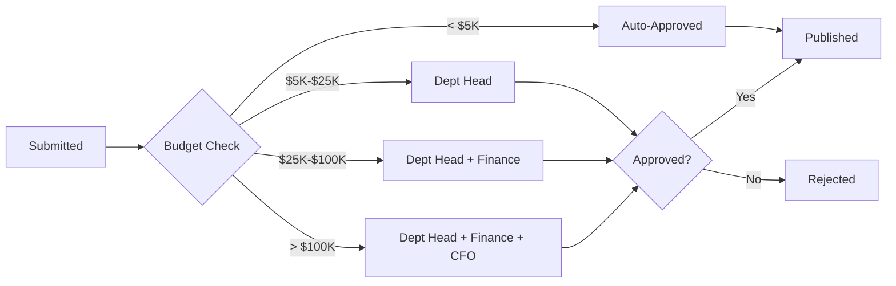

# Requirements Pending API Documentation

## Table of Contents
1. [Quick Start](#quick-start)
2. [API Endpoints](#api-endpoints)
3. [Data Models](#data-models)
4. [Approval Workflow Logic](#approval-workflow-logic)
5. [Filtering & Sorting](#filtering--sorting)
6. [Permissions & Authorization](#permissions--authorization)
7. [UI Integration Guide](#ui-integration-guide)
8. [Error Handling](#error-handling)
9. [Testing Examples](#testing-examples)
10. [Appendix](#appendix)

---

## Quick Start

The Requirements Pending API manages requirements that are awaiting approval from designated approvers. This API enables:

- Viewing requirements awaiting your approval
- Approving requirements with comments
- Rejecting requirements with reasons
- Viewing approval history and timeline
- Tracking approval workflow progress

**Key Use Cases:**
- Department heads reviewing budget requests
- Finance managers approving high-value purchases
- C-level executives authorizing strategic procurements
- Delegated approvers acting on behalf of primary approvers

**Approval Workflow:**


**Related Documentation:**
- [Create Requirement API](./create-requirement-api.md) - Submitting requirements for approval
- [Requirements Approved API](./requirements-approved-api.md) - After approval workflow

---

## API Endpoints

### 1. List Pending Requirements

Retrieve all requirements awaiting approval from the authenticated user.

**Endpoint:** `GET /api/industry/requirements/pending`

**Query Parameters:**
```typescript
{
  page?: number;                // Default: 1
  pageSize?: number;            // Default: 10, Max: 100
  sortBy?: string;              // 'submittedDate' | 'estimatedValue' | 'priority' | 'title'
  sortOrder?: string;           // 'asc' | 'desc', Default: 'desc'
  category?: string;            // Filter by category
  priority?: string;            // Filter by priority
  submittedBy?: string;         // Filter by submitter user ID
  dateFrom?: string;            // ISO date
  dateTo?: string;              // ISO date
  minValue?: number;            // Minimum estimated value
  maxValue?: number;            // Maximum estimated value
  approvalLevel?: string;       // 'department' | 'finance' | 'executive'
}
```

**Request Example:**
```bash
curl -X GET 'https://api.Diligence.ai/api/industry/requirements/pending?page=1&pageSize=10&sortBy=submittedDate&sortOrder=desc' \
  -H 'Authorization: Bearer <token>' \
  -H 'Content-Type: application/json'
```

**Response (200 OK):**
```json
{
  "success": true,
  "data": [
    {
      "id": "req_abc123",
      "requirementId": "REQ-001",
      "title": "Software Development Services",
      "category": "IT Services",
      "priority": "High",
      "estimatedValue": "$50,000",
      "estimatedValueRaw": 50000,
      "submittedDate": "2024-01-15T10:30:00Z",
      "submittedBy": {
        "id": "user_123",
        "name": "John Doe",
        "email": "john.doe@company.com",
        "department": "Engineering"
      },
      "approvalStatus": {
        "currentLevel": "department",
        "currentApprover": {
          "id": "user_456",
          "name": "Jane Smith",
          "role": "Department Head"
        },
        "isPending": true,
        "requiresMyApproval": true,
        "approvalDeadline": "2024-01-22T10:30:00Z",
        "daysRemaining": 5
      },
      "approvalChain": [
        {
          "level": 1,
          "approverRole": "Department Head",
          "approver": {
            "id": "user_456",
            "name": "Jane Smith"
          },
          "status": "pending",
          "required": true
        },
        {
          "level": 2,
          "approverRole": "Finance Manager",
          "approver": {
            "id": "user_789",
            "name": "Bob Wilson"
          },
          "status": "not_started",
          "required": true
        }
      ],
      "summary": "Request for custom CRM development including...",
      "documentsCount": 3,
      "hasQuestions": false,
      "urgencyLevel": "normal"
    }
  ],
  "pagination": {
    "currentPage": 1,
    "pageSize": 10,
    "totalItems": 15,
    "totalPages": 2,
    "hasNextPage": true,
    "hasPreviousPage": false
  },
  "summary": {
    "totalPending": 15,
    "totalValuePending": "$2,450,000",
    "highPriority": 5,
    "approachingDeadline": 3
  }
}
```

---

### 2. Get Requirement Details

Retrieve full details of a specific requirement for approval review.

**Endpoint:** `GET /api/industry/requirements/:requirementId`

**Path Parameters:**
- `requirementId` (string, required) - The unique requirement identifier

**Request Example:**
```bash
curl -X GET 'https://api.Diligence.ai/api/industry/requirements/req_abc123' \
  -H 'Authorization: Bearer <token>' \
  -H 'Content-Type: application/json'
```

**Response (200 OK):**
```json
{
  "success": true,
  "data": {
    "id": "req_abc123",
    "requirementId": "REQ-001",
    "title": "Software Development Services",
    "description": "We need a custom CRM system to manage our client relationships...",
    "category": "IT Services",
    "subcategory": "Custom Software Development",
    "priority": "High",
    "estimatedValue": {
      "amount": 50000,
      "currency": "USD",
      "formatted": "$50,000",
      "budgetRange": {
        "min": 25000,
        "max": 75000
      }
    },
    "submittedDate": "2024-01-15T10:30:00Z",
    "submittedBy": {
      "id": "user_123",
      "name": "John Doe",
      "email": "john.doe@company.com",
      "department": "Engineering",
      "position": "Engineering Manager"
    },
    "specifications": {
      "requirementType": "Technical",
      "technicalDetails": "...",
      "deliveryRequirements": "...",
      "qualityStandards": ["ISO 9001", "CMMI Level 3"],
      "timeline": {
        "expectedStartDate": "2024-02-01",
        "expectedEndDate": "2024-08-01",
        "duration": "6 months"
      }
    },
    "documents": [
      {
        "id": "doc_123",
        "filename": "technical_requirements.pdf",
        "fileSize": 256000,
        "fileType": "application/pdf",
        "documentType": "Technical Specification",
        "uploadedAt": "2024-01-15T10:00:00Z",
        "url": "https://storage.Diligence.ai/documents/doc_123"
      }
    ],
    "approvalWorkflow": {
      "workflowType": "sequential",
      "approvalLevels": [
        {
          "level": 1,
          "approverRole": "Department Head",
          "approver": {
            "id": "user_456",
            "name": "Jane Smith",
            "email": "jane.smith@company.com"
          },
          "status": "pending",
          "approvedAt": null,
          "comments": null,
          "deadline": "2024-01-22T10:30:00Z"
        },
        {
          "level": 2,
          "approverRole": "Finance Manager",
          "approver": {
            "id": "user_789",
            "name": "Bob Wilson",
            "email": "bob.wilson@company.com"
          },
          "status": "not_started",
          "approvedAt": null,
          "comments": null,
          "deadline": "2024-01-25T10:30:00Z"
        }
      ],
      "currentLevel": 1,
      "overallStatus": "pending_approval"
    },
    "businessJustification": {
      "reason": "Current manual processes are inefficient...",
      "expectedBenefits": ["Increased productivity", "Better customer satisfaction"],
      "roiAnalysis": "Expected ROI of 150% within 18 months",
      "alternativesConsidered": "Off-the-shelf CRM solutions were evaluated but don't meet our needs"
    },
    "complianceRequirements": {
      "regulations": ["GDPR", "SOC 2"],
      "certifications": ["ISO 27001"],
      "auditTrail": true
    }
  }
}
```

---

### 3. Approve Requirement

Approve a requirement at your approval level.

**Endpoint:** `POST /api/industry/approvals/:approvalId/approve`

**Path Parameters:**
- `approvalId` (string, required) - The unique approval task identifier

**Request Body:**
```json
{
  "comments": "Approved. Budget allocation confirmed for Q1 2024.",
  "conditions": [
    "Ensure quarterly review checkpoints",
    "Require monthly progress reports"
  ],
  "delegateToNext": false,
  "notifySubmitter": true
}
```

**Request Example:**
```bash
curl -X POST 'https://api.Diligence.ai/api/industry/approvals/approval_xyz789/approve' \
  -H 'Authorization: Bearer <token>' \
  -H 'Content-Type: application/json' \
  -d '{
    "comments": "Approved. Budget allocation confirmed.",
    "conditions": ["Ensure quarterly review"],
    "notifySubmitter": true
  }'
```

**Response (200 OK):**
```json
{
  "success": true,
  "message": "Requirement approved successfully",
  "data": {
    "approvalId": "approval_xyz789",
    "requirementId": "req_abc123",
    "approvedAt": "2024-01-20T14:30:00Z",
    "approvedBy": {
      "id": "user_456",
      "name": "Jane Smith",
      "role": "Department Head"
    },
    "comments": "Approved. Budget allocation confirmed for Q1 2024.",
    "conditions": [
      "Ensure quarterly review checkpoints",
      "Require monthly progress reports"
    ],
    "nextStep": {
      "level": 2,
      "approver": {
        "id": "user_789",
        "name": "Bob Wilson",
        "role": "Finance Manager"
      },
      "notified": true
    },
    "overallStatus": "pending_next_approval"
  }
}
```

---

### 4. Reject Requirement

Reject a requirement with a reason.

**Endpoint:** `POST /api/industry/approvals/:approvalId/reject`

**Path Parameters:**
- `approvalId` (string, required) - The unique approval task identifier

**Request Body:**
```json
{
  "reason": "insufficient_budget",
  "comments": "Current budget allocation does not support this expenditure. Please resubmit in Q2 with revised budget.",
  "recommendations": [
    "Consider phased implementation to reduce upfront cost",
    "Explore alternative vendors with lower pricing"
  ],
  "notifySubmitter": true,
  "allowResubmit": true
}
```

**Rejection Reason Codes:**
- `insufficient_budget` - Budget not available
- `not_strategic_priority` - Does not align with strategic goals
- `incomplete_information` - Missing required details
- `duplicate_request` - Similar requirement already exists
- `vendor_concerns` - Issues with proposed vendors
- `compliance_issues` - Compliance/regulatory concerns
- `timing_issues` - Not the right time for this procurement
- `other` - Other reason (must provide detailed comments)

**Request Example:**
```bash
curl -X POST 'https://api.Diligence.ai/api/industry/approvals/approval_xyz789/reject' \
  -H 'Authorization: Bearer <token>' \
  -H 'Content-Type: application/json' \
  -d '{
    "reason": "insufficient_budget",
    "comments": "Budget not available for Q1. Resubmit in Q2.",
    "notifySubmitter": true,
    "allowResubmit": true
  }'
```

**Response (200 OK):**
```json
{
  "success": true,
  "message": "Requirement rejected",
  "data": {
    "approvalId": "approval_xyz789",
    "requirementId": "req_abc123",
    "rejectedAt": "2024-01-20T14:30:00Z",
    "rejectedBy": {
      "id": "user_456",
      "name": "Jane Smith",
      "role": "Department Head"
    },
    "reason": "insufficient_budget",
    "comments": "Current budget allocation does not support this expenditure. Please resubmit in Q2 with revised budget.",
    "recommendations": [
      "Consider phased implementation to reduce upfront cost",
      "Explore alternative vendors with lower pricing"
    ],
    "canResubmit": true,
    "overallStatus": "rejected"
  }
}
```

---

### 5. Request More Information

Request additional information or clarification from the submitter.

**Endpoint:** `POST /api/industry/approvals/:approvalId/request-info`

**Request Body:**
```json
{
  "questions": [
    "Please provide detailed ROI analysis",
    "Have you obtained quotes from at least 3 vendors?",
    "What is the backup plan if primary vendor cannot deliver?"
  ],
  "deadline": "2024-01-25T17:00:00Z",
  "notifySubmitter": true
}
```

**Response (200 OK):**
```json
{
  "success": true,
  "message": "Information request sent to submitter",
  "data": {
    "requestId": "info_req_123",
    "approvalId": "approval_xyz789",
    "requirementId": "req_abc123",
    "requestedAt": "2024-01-20T14:30:00Z",
    "requestedBy": {
      "id": "user_456",
      "name": "Jane Smith"
    },
    "questions": ["..."],
    "deadline": "2024-01-25T17:00:00Z",
    "status": "awaiting_response"
  }
}
```

---

### 6. Get Approval History

View complete approval history and timeline for a requirement.

**Endpoint:** `GET /api/industry/approvals/:approvalId/history`

**Request Example:**
```bash
curl -X GET 'https://api.Diligence.ai/api/industry/approvals/approval_xyz789/history' \
  -H 'Authorization: Bearer <token>'
```

**Response (200 OK):**
```json
{
  "success": true,
  "data": {
    "requirementId": "req_abc123",
    "approvalId": "approval_xyz789",
    "timeline": [
      {
        "event": "submitted",
        "timestamp": "2024-01-15T10:30:00Z",
        "actor": {
          "id": "user_123",
          "name": "John Doe"
        },
        "details": "Requirement submitted for approval"
      },
      {
        "event": "approval_started",
        "timestamp": "2024-01-15T10:31:00Z",
        "actor": {
          "id": "system",
          "name": "System"
        },
        "details": "Approval workflow initiated. Assigned to Jane Smith (Department Head)"
      },
      {
        "event": "info_requested",
        "timestamp": "2024-01-16T09:00:00Z",
        "actor": {
          "id": "user_456",
          "name": "Jane Smith"
        },
        "details": "Requested additional information: ROI analysis"
      },
      {
        "event": "info_provided",
        "timestamp": "2024-01-17T14:00:00Z",
        "actor": {
          "id": "user_123",
          "name": "John Doe"
        },
        "details": "Provided requested information"
      },
      {
        "event": "approved_level_1",
        "timestamp": "2024-01-20T14:30:00Z",
        "actor": {
          "id": "user_456",
          "name": "Jane Smith"
        },
        "details": "Approved at Department Head level",
        "comments": "Approved. Budget allocation confirmed."
      },
      {
        "event": "approval_escalated",
        "timestamp": "2024-01-20T14:31:00Z",
        "actor": {
          "id": "system",
          "name": "System"
        },
        "details": "Escalated to Finance Manager (Bob Wilson)"
      }
    ],
    "currentStatus": "pending_next_approval",
    "totalDuration": "5 days",
    "averageApprovalTime": "3 days per level"
  }
}
```

---

### 7. Delegate Approval

Delegate approval authority to another user.

**Endpoint:** `POST /api/industry/approvals/:approvalId/delegate`

**Request Body:**
```json
{
  "delegateTo": "user_999",
  "reason": "I will be on vacation from Jan 22-30",
  "expiresAt": "2024-01-30T23:59:59Z",
  "notifyDelegate": true
}
```

**Response (200 OK):**
```json
{
  "success": true,
  "message": "Approval delegated successfully",
  "data": {
    "delegationId": "del_123",
    "originalApprover": {
      "id": "user_456",
      "name": "Jane Smith"
    },
    "delegate": {
      "id": "user_999",
      "name": "Sarah Johnson"
    },
    "expiresAt": "2024-01-30T23:59:59Z",
    "notified": true
  }
}
```

---

## Data Models

### PendingRequirement

Summary for display in pending requirements list.

```typescript
interface PendingRequirement {
  id: string;
  requirementId: string;                // Display ID (REQ-001)
  title: string;
  category: string;
  priority: 'Critical' | 'High' | 'Medium' | 'Low';
  estimatedValue: string;               // Formatted "$50,000"
  estimatedValueRaw: number;            // 50000
  submittedDate: string;                // ISO 8601
  submittedBy: {
    id: string;
    name: string;
    email: string;
    department: string;
  };
  approvalStatus: {
    currentLevel: string;               // 'department' | 'finance' | 'executive'
    currentApprover: {
      id: string;
      name: string;
      role: string;
    };
    isPending: boolean;
    requiresMyApproval: boolean;
    approvalDeadline: string;           // ISO 8601
    daysRemaining: number;
  };
  approvalChain: ApprovalLevel[];
  summary: string;                      // Brief description
  documentsCount: number;
  hasQuestions: boolean;                // Has pending info requests
  urgencyLevel: 'urgent' | 'normal' | 'low';
}

interface ApprovalLevel {
  level: number;                        // 1, 2, 3
  approverRole: string;                 // 'Department Head', 'Finance Manager'
  approver: {
    id: string;
    name: string;
  };
  status: 'pending' | 'approved' | 'rejected' | 'not_started';
  required: boolean;
}
```

### ApprovalAction

Request body for approve/reject actions.

```typescript
interface ApprovalActionRequest {
  comments: string;                     // Required for reject, optional for approve
  conditions?: string[];                // Approval conditions
  recommendations?: string[];           // For rejections
  notifySubmitter?: boolean;            // Default: true
  delegateToNext?: boolean;             // Auto-delegate to next level
}

interface ApprovalActionResponse {
  success: boolean;
  message: string;
  data: {
    approvalId: string;
    requirementId: string;
    approvedAt?: string;                // ISO 8601
    rejectedAt?: string;                // ISO 8601
    approvedBy: {
      id: string;
      name: string;
      role: string;
    };
    comments: string;
    conditions?: string[];
    nextStep?: {
      level: number;
      approver: {
        id: string;
        name: string;
        role: string;
      };
      notified: boolean;
    };
    overallStatus: string;              // 'pending_next_approval' | 'approved' | 'rejected'
  };
}
```

### ApprovalHistory

Timeline of all approval events.

```typescript
interface ApprovalHistory {
  requirementId: string;
  approvalId: string;
  timeline: ApprovalEvent[];
  currentStatus: string;
  totalDuration: string;
  averageApprovalTime: string;
}

interface ApprovalEvent {
  event: 'submitted' | 'approval_started' | 'approved_level_1' | 'approved_level_2' | 
         'approved_level_3' | 'rejected' | 'info_requested' | 'info_provided' | 
         'approval_escalated' | 'delegated';
  timestamp: string;                    // ISO 8601
  actor: {
    id: string;
    name: string;
  };
  details: string;
  comments?: string;
}
```

---

## Approval Workflow Logic

### Budget-Based Approval Matrix

| Estimated Value | Required Approvals | Timeline |
|----------------|-------------------|----------|
| < $5,000 | Auto-approved | Immediate |
| $5,000 - $25,000 | Department Head | 3 business days |
| $25,000 - $100,000 | Dept Head + Finance Manager | 5 business days |
| > $100,000 | Dept Head + Finance + CFO | 7 business days |

### Workflow Types

**1. Sequential Approval (Default)**
- Approvals happen one level at a time
- Next level starts only after previous level approves
- Any rejection stops the entire workflow

**2. Parallel Approval**
- Multiple approvers at same level can approve simultaneously
- Requires all approvers at a level to approve before moving to next
- Used for committee-based decisions

**3. Unanimous Approval**
- All approvers must approve
- Single rejection stops the workflow

**4. Majority Approval**
- Requires > 50% of approvers to approve
- Used for board-level decisions

### Priority-Based Escalation

Requirements with `Critical` or `High` priority get expedited processing:

- **Critical:** 1 business day per approval level
- **High:** 2 business days per approval level
- **Medium:** 3 business days per approval level
- **Low:** 5 business days per approval level

### Auto-Escalation Rules

If approver doesn't respond within deadline:

1. **First Reminder:** Email sent at 50% of deadline
2. **Second Reminder:** Email + SMS at 80% of deadline
3. **Escalation:** After deadline, escalate to:
   - Approver's manager (if available)
   - Or next approval level
   - Or designated backup approver

### Delegation Rules

Approvers can delegate their authority:

- **Temporary Delegation:** Valid for specific date range (e.g., during vacation)
- **Permanent Delegation:** Transfer all approval authority
- **Conditional Delegation:** Only for specific categories or value ranges
- **Emergency Bypass:** C-level can override and approve immediately

### Approval Modifications

After approval, modifications trigger re-approval if:

- Budget increases by > 10%
- Scope changes significantly
- Timeline extends by > 20%
- Vendor changes

Minor changes (< 5% budget, small scope tweaks) don't require re-approval.

---

## Filtering & Sorting

### Available Filters

| Filter | Type | Options | Default |
|--------|------|---------|---------|
| category | string | Any category | All |
| priority | string | Critical, High, Medium, Low | All |
| submittedBy | string | User ID | All |
| approvalLevel | string | department, finance, executive | All |
| dateFrom/dateTo | date | ISO 8601 | Last 30 days |
| minValue/maxValue | number | Currency amount | No limit |

### Sort Options

| Field | Description | Default Order |
|-------|-------------|---------------|
| submittedDate | Most recent submissions first | DESC |
| estimatedValue | Highest value first | DESC |
| priority | Critical → Low | DESC |
| title | Alphabetical | ASC |
| approvalDeadline | Most urgent first | ASC |

### Pre-Built Filter Views

**My Urgent Approvals:**
```
priority=Critical,High&approvalDeadline<3days&requiresMyApproval=true
```

**High Value Requests:**
```
minValue=100000&sortBy=estimatedValue&sortOrder=desc
```

**Overdue Approvals:**
```
approvalDeadline<now&status=pending
```

---

## Permissions & Authorization

### Role-Based Access

| Role | View Pending | Approve | Reject | Delegate | View All |
|------|-------------|---------|---------|----------|----------|
| Industry User | ❌ | ❌ | ❌ | ❌ | ❌ |
| Department Head | ✅ Dept only | ✅ Level 1 | ✅ Level 1 | ✅ | ✅ Dept |
| Finance Manager | ✅ Financial | ✅ Level 2 | ✅ Level 2 | ✅ | ✅ All |
| CFO | ✅ All | ✅ All levels | ✅ All levels | ✅ | ✅ All |
| Admin | ✅ All | ❌ | ❌ | ❌ | ✅ All |

### Authorization Checks

```typescript
// Check if user can approve
function canApprove(user: User, approval: Approval): boolean {
  // Check if it's user's turn to approve
  if (approval.currentApprover.id !== user.id) {
    // Check if user is a delegate
    if (!isDelegatedTo(user.id, approval.currentApprover.id)) {
      return false;
    }
  }
  
  // Check if user has approval authority for this value
  const maxApprovalLimit = user.approvalLimits[approval.category];
  if (approval.estimatedValue > maxApprovalLimit) {
    return false;
  }
  
  return true;
}
```

### Approval Authority Matrix

Each approver has limits based on role and experience:

```typescript
interface ApprovalLimits {
  department_head: {
    max_value: 25000,
    categories: ['all'],
    requires_training: false
  },
  finance_manager: {
    max_value: 100000,
    categories: ['all'],
    requires_training: true
  },
  cfo: {
    max_value: Infinity,
    categories: ['all'],
    requires_training: true
  }
}
```

---

## UI Integration Guide

### Pending Requirements Table

```typescript
// src/pages/RequirementsPending.tsx
import { useState, useEffect } from 'react';
import CustomTable from '@/components/CustomTable';
import { requirementsListService } from '@/services/requirements-list.service';

const RequirementsPending = () => {
  const [requirements, setRequirements] = useState([]);
  const [loading, setLoading] = useState(true);

  useEffect(() => {
    loadPendingRequirements();
  }, []);

  const loadPendingRequirements = async () => {
    try {
      const response = await requirementsListService.getPendingRequirements({
        page: 1,
        pageSize: 10,
        sortBy: 'submittedDate',
        sortOrder: 'desc'
      });
      setRequirements(response.data);
    } catch (error) {
      console.error('Failed to load pending requirements:', error);
    } finally {
      setLoading(false);
    }
  };

  const handleApprove = async (approvalId: string) => {
    // Show approval modal
    const result = await showApprovalModal(approvalId);
    if (result.confirmed) {
      await requirementsListService.approveRequirement(approvalId, {
        comments: result.comments,
        conditions: result.conditions,
        notifySubmitter: true
      });
      toast.success('Requirement approved successfully');
      loadPendingRequirements(); // Refresh list
    }
  };

  const handleReject = async (approvalId: string) => {
    const result = await showRejectionModal(approvalId);
    if (result.confirmed) {
      await requirementsListService.rejectRequirement(approvalId, {
        reason: result.reason,
        comments: result.comments,
        recommendations: result.recommendations,
        notifySubmitter: true,
        allowResubmit: true
      });
      toast.success('Requirement rejected');
      loadPendingRequirements();
    }
  };

  return (
    <CustomTable
      columns={columns}
      data={requirements}
      loading={loading}
      actions={[
        {
          label: 'Approve',
          onClick: (row) => handleApprove(row.approvalId),
          variant: 'default'
        },
        {
          label: 'Reject',
          onClick: (row) => handleReject(row.approvalId),
          variant: 'destructive'
        }
      ]}
    />
  );
};
```

### Approval Modal Component

```typescript
const ApprovalModal = ({ approvalId, onConfirm, onCancel }) => {
  const [comments, setComments] = useState('');
  const [conditions, setConditions] = useState<string[]>([]);

  return (
    <Dialog open onOpenChange={onCancel}>
      <DialogContent>
        <DialogHeader>
          <DialogTitle>Approve Requirement</DialogTitle>
        </DialogHeader>
        <div className="space-y-4">
          <Textarea
            placeholder="Add approval comments (optional)"
            value={comments}
            onChange={(e) => setComments(e.target.value)}
          />
          <div>
            <Label>Approval Conditions</Label>
            {conditions.map((condition, i) => (
              <Input
                key={i}
                value={condition}
                onChange={(e) => {
                  const newConditions = [...conditions];
                  newConditions[i] = e.target.value;
                  setConditions(newConditions);
                }}
              />
            ))}
            <Button
              variant="outline"
              size="sm"
              onClick={() => setConditions([...conditions, ''])}
            >
              Add Condition
            </Button>
          </div>
        </div>
        <DialogFooter>
          <Button variant="outline" onClick={onCancel}>
            Cancel
          </Button>
          <Button
            onClick={() => onConfirm({ comments, conditions })}
          >
            Approve
          </Button>
        </DialogFooter>
      </DialogContent>
    </Dialog>
  );
};
```

### Approval Timeline Component

```typescript
const ApprovalTimeline = ({ approvalId }) => {
  const [history, setHistory] = useState([]);

  useEffect(() => {
    loadHistory();
  }, [approvalId]);

  const loadHistory = async () => {
    const response = await requirementsListService.getApprovalHistory(approvalId);
    setHistory(response.data.timeline);
  };

  return (
    <div className="space-y-4">
      {history.map((event, index) => (
        <div key={index} className="flex gap-4">
          <div className="flex-shrink-0">
            {getEventIcon(event.event)}
          </div>
          <div>
            <div className="font-medium">{event.details}</div>
            <div className="text-sm text-muted-foreground">
              {event.actor.name} • {format(new Date(event.timestamp), 'PPp')}
            </div>
            {event.comments && (
              <div className="mt-2 p-2 bg-muted rounded text-sm">
                {event.comments}
              </div>
            )}
          </div>
        </div>
      ))}
    </div>
  );
};
```

### Priority Badge Component

```typescript
const PriorityBadge = ({ priority }) => {
  const variants = {
    Critical: 'destructive',
    High: 'default',
    Medium: 'secondary',
    Low: 'outline'
  };

  return (
    <Badge variant={variants[priority]}>
      {priority}
    </Badge>
  );
};
```

---

## Error Handling

### HTTP Status Codes

| Code | Meaning | Recovery |
|------|---------|----------|
| 200 | Success | Continue |
| 400 | Invalid request | Fix validation errors |
| 401 | Not authenticated | Re-login |
| 403 | No approval authority | Contact admin |
| 404 | Approval not found | Refresh list |
| 409 | Already processed | Refresh to see status |
| 410 | Expired/withdrawn | Remove from list |
| 429 | Rate limited | Wait and retry |
| 500 | Server error | Retry or contact support |

### Error Scenarios

**Already Approved/Rejected:**
```typescript
if (error.code === 'ALREADY_PROCESSED') {
  toast.info('This requirement has already been processed by another approver');
  // Refresh list to remove from pending
  loadPendingRequirements();
}
```

**Insufficient Authority:**
```typescript
if (error.code === 'INSUFFICIENT_AUTHORITY') {
  showDialog({
    title: 'Cannot Approve',
    message: `This requirement exceeds your approval limit of ${formatCurrency(user.approvalLimit)}. It has been escalated to ${error.details.escalatedTo}.`,
    variant: 'info'
  });
}
```

**Concurrent Processing:**
```typescript
if (error.code === 'CONCURRENT_PROCESSING') {
  showDialog({
    title: 'Processing in Progress',
    message: 'Another approver is currently reviewing this requirement. Please try again in a few moments.',
    action: {
      label: 'Refresh',
      onClick: () => loadPendingRequirements()
    }
  });
}
```

---

## Testing Examples

### cURL Examples

**1. List Pending Requirements:**
```bash
curl -X GET 'https://api.Diligence.ai/api/industry/requirements/pending' \
  -H 'Authorization: Bearer <token>'
```

**2. Approve Requirement:**
```bash
curl -X POST 'https://api.Diligence.ai/api/industry/approvals/approval_123/approve' \
  -H 'Authorization: Bearer <token>' \
  -H 'Content-Type: application/json' \
  -d '{
    "comments": "Approved",
    "notifySubmitter": true
  }'
```

**3. Reject Requirement:**
```bash
curl -X POST 'https://api.Diligence.ai/api/industry/approvals/approval_123/reject' \
  -H 'Authorization: Bearer <token>' \
  -H 'Content-Type: application/json' \
  -d '{
    "reason": "insufficient_budget",
    "comments": "Please resubmit in Q2",
    "notifySubmitter": true,
    "allowResubmit": true
  }'
```

**4. Get Approval History:**
```bash
curl -X GET 'https://api.Diligence.ai/api/industry/approvals/approval_123/history' \
  -H 'Authorization: Bearer <token>'
```

### Test Scenarios

**Scenario 1: Approve Low-Value Requirement**
1. Submit requirement with value < $5K
2. Verify auto-approved (no approval needed)
3. Check appears in Approved list immediately

**Scenario 2: Multi-Level Approval**
1. Submit requirement with value $50K
2. Dept Head approves → Check moves to Finance Manager
3. Finance Manager approves → Check moves to Approved
4. Verify timeline shows both approvals

**Scenario 3: Rejection Flow**
1. Submit requirement
2. Dept Head rejects with reason
3. Verify submitter receives notification
4. Verify requirement appears in Rejected list
5. Submitter can view rejection reason and recommendations

**Scenario 4: Delegation**
1. Approver delegates to colleague for 1 week
2. Pending requirements appear in delegate's list
3. Delegate can approve/reject
4. After expiry, authority returns to original approver

**Scenario 5: Escalation**
1. Submit urgent requirement
2. Set short deadline (1 day)
3. Approver doesn't respond
4. Verify auto-escalation after deadline
5. Next level approver receives notification

---

## Appendix

### Related Documentation
- [Create Requirement API](./create-requirement-api.md)
- [Requirements Approved API](./requirements-approved-api.md)
- [Notification System API](./notifications-api.md)

### Approval Workflow Configuration

See `docs/workflows/approval-matrix-configuration.md` for details on configuring custom approval workflows.

### Database Schema

**Approvals Collection:**
```json
{
  "_id": "ObjectId",
  "requirementId": "ObjectId",
  "workflowType": "sequential",
  "approvalLevels": [
    {
      "level": 1,
      "approverRole": "Department Head",
      "approverId": "ObjectId",
      "status": "pending",
      "deadline": "Date",
      "approvedAt": "Date",
      "comments": "String"
    }
  ],
  "currentLevel": 1,
  "overallStatus": "pending_approval",
  "timeline": ["Array of events"],
  "createdAt": "Date",
  "updatedAt": "Date"
}
```

---

**Last Updated:** 2024-01-20  
**API Version:** 1.0.0  
**Author:** Diligence.ai Backend Team
