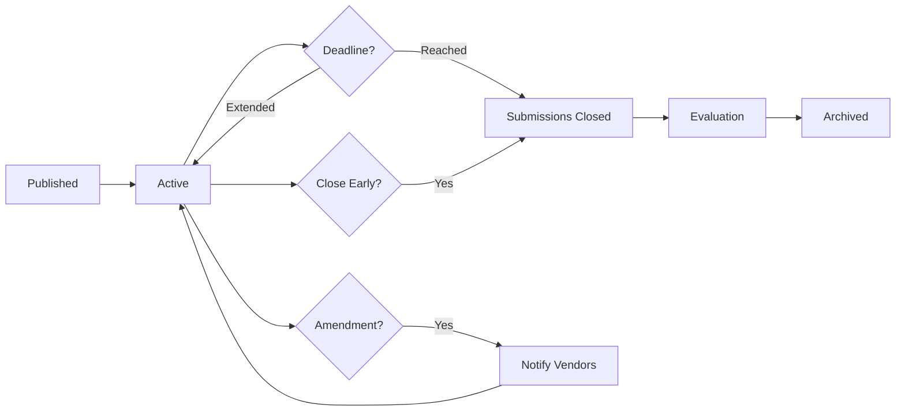

# Requirements Published API Documentation

## Table of Contents
1. [Quick Start](#quick-start)
2. [API Endpoints](#api-endpoints)
3. [Data Models](#data-models)
4. [Business Rules & Logic](#business-rules--logic)
5. [Filtering & Sorting](#filtering--sorting)
6. [Permissions & Authorization](#permissions--authorization)
7. [UI Integration Guide](#ui-integration-guide)
8. [Error Handling](#error-handling)
9. [Testing Examples](#testing-examples)
10. [Appendix](#appendix)

---

## Quick Start

The Requirements Published API manages active requirements that have been published to vendors and are currently accepting quotes/proposals. This API enables:

- Viewing all published requirements
- Tracking vendor engagement (views, quotes submitted)
- Managing requirement lifecycle (extend deadline, close early)
- Publishing amendments and clarifications
- Viewing and responding to vendor questions
- Analyzing requirement performance

**Key Use Cases:**
- Industry users monitoring response rates
- Tracking which vendors have viewed requirements
- Answering vendor questions
- Extending submission deadlines
- Closing requirements early when suitable vendors found
- Analyzing requirement engagement metrics

**Published Requirement Lifecycle:**


**Related Documentation:**
- [Requirements Approved API](./requirements-approved-api.md) - Before publication
- [Quote Management API](./quote-management-api.md) - Vendor responses
- [Requirements Archived API](./requirements-archived-api.md) - After completion

---

## API Endpoints

### 1. List Published Requirements

Retrieve all published requirements with vendor engagement metrics.

**Endpoint:** `GET /api/industry/requirements/published`

**Query Parameters:**
```typescript
{
  page?: number;                  // Default: 1
  pageSize?: number;              // Default: 10, Max: 100
  sortBy?: string;                // 'publishedDate' | 'deadline' | 'quotesReceived' | 'views'
  sortOrder?: string;             // 'asc' | 'desc'
  category?: string;              // Filter by category
  priority?: string;              // Filter by priority
  status?: string;                // 'active' | 'closing_soon' | 'closed'
  dateFrom?: string;              // ISO date
  dateTo?: string;                // ISO date
  minQuotes?: number;             // Minimum quotes received
  hasQuestions?: boolean;         // Filter by pending questions
}
```

**Request Example:**
```bash
curl -X GET 'https://api.Diligence.ai/api/industry/requirements/published?page=1&pageSize=10&sortBy=publishedDate&sortOrder=desc' \
  -H 'Authorization: Bearer <token>' \
  -H 'Content-Type: application/json'
```

**Response (200 OK):**
```json
{
  "success": true,
  "data": [
    {
      "id": "req_abc123",
      "requirementId": "REQ-001",
      "title": "Software Development Services",
      "category": "IT Services",
      "priority": "High",
      "estimatedValue": "$50,000",
      "publishedDate": "2024-01-21T09:00:00Z",
      "submissionDeadline": "2024-02-15T17:00:00Z",
      "daysRemaining": 25,
      "status": "active",
      "engagement": {
        "totalViews": 127,
        "uniqueVendors": 45,
        "quotesReceived": 12,
        "questionsAsked": 8,
        "questionsAnswered": 6,
        "responseRate": 26.7,
        "averageQuoteValue": "$48,500"
      },
      "visibility": "all_vendors",
      "hasActiveQuestions": true,
      "canExtendDeadline": true,
      "canClose": true,
      "publicUrl": "https://app.Diligence.ai/requirements/REQ-001"
    }
  ],
  "pagination": {
    "currentPage": 1,
    "pageSize": 10,
    "totalItems": 5,
    "totalPages": 1,
    "hasNextPage": false,
    "hasPreviousPage": false
  },
  "summary": {
    "totalPublished": 5,
    "totalActive": 4,
    "closingSoon": 1,
    "totalQuotesReceived": 38,
    "averageResponseRate": 24.5
  }
}
```

---

### 2. Get Published Requirement Details

Retrieve comprehensive details of a specific published requirement including all engagement metrics.

**Endpoint:** `GET /api/industry/requirements/:requirementId`

**Request Example:**
```bash
curl -X GET 'https://api.Diligence.ai/api/industry/requirements/req_abc123' \
  -H 'Authorization: Bearer <token>'
```

**Response (200 OK):**
```json
{
  "success": true,
  "data": {
    "id": "req_abc123",
    "requirementId": "REQ-001",
    "title": "Software Development Services",
    "description": "Full description...",
    "category": "IT Services",
    "priority": "High",
    "estimatedValue": {
      "amount": 50000,
      "currency": "USD",
      "formatted": "$50,000"
    },
    "publishedDate": "2024-01-21T09:00:00Z",
    "submissionDeadline": "2024-02-15T17:00:00Z",
    "daysRemaining": 25,
    "status": "active",
    "engagement": {
      "totalViews": 127,
      "uniqueVendors": 45,
      "viewsByDay": [
        { "date": "2024-01-21", "views": 35 },
        { "date": "2024-01-22", "views": 42 },
        { "date": "2024-01-23", "views": 50 }
      ],
      "quotesReceived": 12,
      "quotesByDay": [
        { "date": "2024-01-22", "count": 3 },
        { "date": "2024-01-23", "count": 5 },
        { "date": "2024-01-24", "count": 4 }
      ],
      "responseRate": 26.7,
      "averageQuoteValue": "$48,500",
      "quoteValueRange": {
        "min": "$35,000",
        "max": "$65,000"
      }
    },
    "vendorActivity": [
      {
        "vendorId": "vendor_123",
        "vendorName": "TechSoft Solutions",
        "viewedAt": "2024-01-21T10:30:00Z",
        "viewCount": 3,
        "hasSubmittedQuote": true,
        "quoteSubmittedAt": "2024-01-23T14:00:00Z",
        "questionsAsked": 2
      }
    ],
    "questions": [
      {
        "id": "q_123",
        "vendorId": "vendor_123",
        "vendorName": "TechSoft Solutions",
        "question": "Can the timeline be extended to 8 months?",
        "askedAt": "2024-01-22T11:00:00Z",
        "answer": "Yes, we can accommodate an 8-month timeline if needed.",
        "answeredAt": "2024-01-22T15:00:00Z",
        "answeredBy": {
          "id": "user_123",
          "name": "John Doe"
        },
        "isPublic": true
      }
    ],
    "amendments": [
      {
        "id": "amend_1",
        "title": "Budget Clarification",
        "description": "Budget range updated to reflect current estimates",
        "publishedAt": "2024-01-25T10:00:00Z",
        "publishedBy": {
          "id": "user_123",
          "name": "John Doe"
        }
      }
    ],
    "documents": [
      {
        "id": "doc_123",
        "filename": "technical_spec.pdf",
        "downloads": 35
      }
    ],
    "permissions": {
      "canExtendDeadline": true,
      "canClose": true,
      "canAmend": true,
      "canAnswerQuestions": true
    }
  }
}
```

---

### 3. Get Vendor Responses

Retrieve all quotes/proposals submitted for a requirement.

**Endpoint:** `GET /api/industry/requirements/:requirementId/responses`

**Query Parameters:**
```typescript
{
  status?: string;                // 'submitted' | 'shortlisted' | 'rejected'
  sortBy?: string;                // 'submittedDate' | 'quoteValue' | 'vendorRating'
  sortOrder?: string;             // 'asc' | 'desc'
}
```

**Request Example:**
```bash
curl -X GET 'https://api.Diligence.ai/api/industry/requirements/req_abc123/responses?sortBy=quoteValue&sortOrder=asc' \
  -H 'Authorization: Bearer <token>'
```

**Response (200 OK):**
```json
{
  "success": true,
  "data": [
    {
      "id": "quote_123",
      "vendorId": "vendor_123",
      "vendorName": "TechSoft Solutions",
      "vendorRating": 4.8,
      "vendorCertifications": ["ISO 9001", "CMMI Level 3"],
      "quoteValue": {
        "amount": 48500,
        "currency": "USD",
        "formatted": "$48,500"
      },
      "proposedTimeline": "7 months",
      "submittedAt": "2024-01-23T14:00:00Z",
      "status": "submitted",
      "summary": "Brief proposal summary...",
      "documentsCount": 3,
      "hasVideo": false,
      "matchScore": 92,
      "technicalScore": null,
      "commercialScore": null
    }
  ],
  "summary": {
    "totalResponses": 12,
    "averageQuoteValue": "$48,500",
    "lowestQuote": "$35,000",
    "highestQuote": "$65,000",
    "shortlisted": 3,
    "rejected": 0
  }
}
```

---

### 4. Get Requirement Analytics

Retrieve detailed analytics and engagement metrics.

**Endpoint:** `GET /api/industry/requirements/:requirementId/analytics`

**Request Example:**
```bash
curl -X GET 'https://api.Diligence.ai/api/industry/requirements/req_abc123/analytics' \
  -H 'Authorization: Bearer <token>'
```

**Response (200 OK):**
```json
{
  "success": true,
  "data": {
    "requirementId": "req_abc123",
    "publishedDate": "2024-01-21T09:00:00Z",
    "daysActive": 3,
    "engagement": {
      "views": {
        "total": 127,
        "uniqueVendors": 45,
        "byDay": [
          { "date": "2024-01-21", "views": 35, "uniqueVendors": 35 },
          { "date": "2024-01-22", "views": 42, "uniqueVendors": 8 },
          { "date": "2024-01-23", "views": 50, "uniqueVendors": 2 }
        ],
        "peakViewDay": "2024-01-23"
      },
      "quotes": {
        "total": 12,
        "byDay": [
          { "date": "2024-01-22", "count": 3 },
          { "date": "2024-01-23", "count": 5 },
          { "date": "2024-01-24", "count": 4 }
        ],
        "averageTimeToSubmit": "2.5 days",
        "conversionRate": 26.7,
        "responseQuality": "high"
      },
      "questions": {
        "total": 8,
        "answered": 6,
        "pending": 2,
        "averageResponseTime": "4 hours",
        "topQuestionCategories": [
          { "category": "Timeline", "count": 3 },
          { "category": "Budget", "count": 2 },
          { "category": "Technical", "count": 3 }
        ]
      },
      "documents": {
        "totalDownloads": 135,
        "mostDownloaded": {
          "filename": "technical_spec.pdf",
          "downloads": 45
        }
      }
    },
    "vendorDemographics": {
      "byCategory": {
        "IT Services": 40,
        "Software Development": 5
      },
      "byCertification": {
        "ISO 9001": 32,
        "CMMI Level 3": 15,
        "None": 8
      },
      "byExperience": {
        "0-2 years": 5,
        "3-5 years": 15,
        "5+ years": 25
      }
    },
    "quoteAnalysis": {
      "valueDistribution": [
        { "range": "$30K-$40K", "count": 2 },
        { "range": "$40K-$50K", "count": 6 },
        { "range": "$50K-$60K", "count": 3 },
        { "range": "$60K+", "count": 1 }
      ],
      "averageValue": "$48,500",
      "median": "$47,000",
      "standardDeviation": "$8,200"
    },
    "projections": {
      "estimatedFinalResponses": 18,
      "expectedClosingDate": "2024-02-15",
      "recommendedDeadlineExtension": false
    }
  }
}
```

---

### 5. Extend Submission Deadline

Extend the deadline for vendors to submit quotes.

**Endpoint:** `POST /api/industry/requirements/:requirementId/extend-deadline`

**Request Body:**
```json
{
  "newDeadline": "2024-03-01T17:00:00Z",
  "reason": "Multiple vendors requested additional time to prepare comprehensive proposals",
  "notifyVendors": true
}
```

**Request Example:**
```bash
curl -X POST 'https://api.Diligence.ai/api/industry/requirements/req_abc123/extend-deadline' \
  -H 'Authorization: Bearer <token>' \
  -H 'Content-Type: application/json' \
  -d '{
    "newDeadline": "2024-03-01T17:00:00Z",
    "reason": "Additional time requested",
    "notifyVendors": true
  }'
```

**Response (200 OK):**
```json
{
  "success": true,
  "message": "Deadline extended successfully",
  "data": {
    "requirementId": "req_abc123",
    "originalDeadline": "2024-02-15T17:00:00Z",
    "newDeadline": "2024-03-01T17:00:00Z",
    "extensionDays": 14,
    "extensionCount": 1,
    "maxExtensionsAllowed": 2,
    "canExtendAgain": true,
    "notifications": {
      "vendorsNotified": 45,
      "emailsSent": 45,
      "inAppNotifications": 45
    },
    "updatedAt": "2024-01-24T10:00:00Z"
  }
}
```

---

### 6. Close Requirement Early

Close a requirement before the deadline (e.g., when sufficient quotes received).

**Endpoint:** `POST /api/industry/requirements/:requirementId/close`

**Request Body:**
```json
{
  "reason": "sufficient_responses",
  "comments": "Received 12 high-quality quotes, proceeding to evaluation phase",
  "notifyVendors": true,
  "allowLateSubmissions": false
}
```

**Reason Codes:**
- `sufficient_responses` - Enough quotes received
- `requirement_fulfilled` - Already found suitable vendor
- `budget_cancelled` - Budget no longer available
- `requirement_changed` - Requirement specifications changed significantly
- `other` - Other reason

**Response (200 OK):**
```json
{
  "success": true,
  "message": "Requirement closed successfully",
  "data": {
    "requirementId": "req_abc123",
    "closedAt": "2024-01-24T15:00:00Z",
    "closedBy": {
      "id": "user_123",
      "name": "John Doe"
    },
    "reason": "sufficient_responses",
    "daysActive": 3,
    "originalDeadline": "2024-02-15T17:00:00Z",
    "daysBeforeDeadline": 22,
    "finalStats": {
      "totalViews": 127,
      "quotesReceived": 12,
      "responseRate": 26.7
    },
    "nextSteps": "Proceed to quote evaluation and vendor selection",
    "notifications": {
      "vendorsNotified": 45
    }
  }
}
```

---

### 7. Publish Amendment

Publish a clarification or update to a published requirement.

**Endpoint:** `POST /api/industry/requirements/:requirementId/amend`

**Request Body:**
```json
{
  "title": "Budget Range Clarification",
  "description": "The budget range has been updated to $45,000 - $80,000 based on recent cost analysis",
  "changes": {
    "estimatedBudget": {
      "old": "$50,000",
      "new": "$45,000 - $80,000"
    }
  },
  "notifyVendors": true,
  "resetQuoteDeadline": false
}
```

**Response (200 OK):**
```json
{
  "success": true,
  "message": "Amendment published successfully",
  "data": {
    "amendmentId": "amend_123",
    "requirementId": "req_abc123",
    "title": "Budget Range Clarification",
    "publishedAt": "2024-01-25T10:00:00Z",
    "publishedBy": {
      "id": "user_123",
      "name": "John Doe"
    },
    "version": 2,
    "notifications": {
      "vendorsNotified": 45,
      "vendorsWhoViewed": 40,
      "vendorsWhoQuoted": 12
    }
  }
}
```

---

### 8. Answer Vendor Question

Respond to a vendor's question about the requirement.

**Endpoint:** `POST /api/industry/requirements/questions/:questionId/answer`

**Request Body:**
```json
{
  "answer": "Yes, we can accommodate an 8-month timeline. Please reflect this in your proposal.",
  "isPublic": true,
  "notifyAllVendors": true
}
```

**Response (200 OK):**
```json
{
  "success": true,
  "message": "Question answered successfully",
  "data": {
    "questionId": "q_123",
    "requirementId": "req_abc123",
    "answer": "Yes, we can accommodate an 8-month timeline...",
    "answeredAt": "2024-01-22T15:00:00Z",
    "answeredBy": {
      "id": "user_123",
      "name": "John Doe"
    },
    "isPublic": true,
    "notifications": {
      "vendorsNotified": 45,
      "askerNotified": true
    }
  }
}
```

---

## Data Models

### PublishedRequirement

```typescript
interface PublishedRequirement {
  id: string;
  requirementId: string;                    // Display ID (REQ-001)
  title: string;
  category: string;
  priority: 'Critical' | 'High' | 'Medium' | 'Low';
  estimatedValue: string;                   // Formatted
  publishedDate: string;                    // ISO 8601
  submissionDeadline: string;               // ISO 8601
  daysRemaining: number;
  status: 'active' | 'closing_soon' | 'closed';
  engagement: EngagementMetrics;
  visibility: 'all_vendors' | 'selected_vendors' | 'public';
  hasActiveQuestions: boolean;
  canExtendDeadline: boolean;
  canClose: boolean;
  publicUrl: string;
}

interface EngagementMetrics {
  totalViews: number;
  uniqueVendors: number;
  quotesReceived: number;
  questionsAsked: number;
  questionsAnswered: number;
  responseRate: number;                     // Percentage
  averageQuoteValue: string;
}
```

### RequirementAnalytics

```typescript
interface RequirementAnalytics {
  requirementId: string;
  publishedDate: string;
  daysActive: number;
  engagement: {
    views: ViewAnalytics;
    quotes: QuoteAnalytics;
    questions: QuestionAnalytics;
    documents: DocumentAnalytics;
  };
  vendorDemographics: VendorDemographics;
  quoteAnalysis: QuoteAnalysis;
  projections: Projections;
}

interface ViewAnalytics {
  total: number;
  uniqueVendors: number;
  byDay: Array<{ date: string; views: number; uniqueVendors: number }>;
  peakViewDay: string;
}

interface QuoteAnalytics {
  total: number;
  byDay: Array<{ date: string; count: number }>;
  averageTimeToSubmit: string;
  conversionRate: number;
  responseQuality: 'low' | 'medium' | 'high';
}
```

### VendorResponse

```typescript
interface VendorResponse {
  id: string;
  vendorId: string;
  vendorName: string;
  vendorRating: number;
  vendorCertifications: string[];
  quoteValue: {
    amount: number;
    currency: string;
    formatted: string;
  };
  proposedTimeline: string;
  submittedAt: string;
  status: 'submitted' | 'shortlisted' | 'rejected' | 'selected';
  summary: string;
  documentsCount: number;
  hasVideo: boolean;
  matchScore: number;
  technicalScore?: number;
  commercialScore?: number;
}
```

---

## Business Rules & Logic

### Deadline Extension Rules

| Extension # | Max Days | Approval Required |
|------------|----------|-------------------|
| 1st | 14 days | No |
| 2nd | 14 days | Department Head |
| 3rd+ | Not allowed | N/A |

**Auto-Extension Conditions:**
- If < 5 quotes received and < 3 days remaining → Suggest extension
- If > 50% of vendors request extension → Auto-suggest

### Early Closure Rules

Can close requirement early if:
- Received >= 5 quotes from qualified vendors
- At least 7 days have passed since publication
- Or found ideal vendor and closing reason is `requirement_fulfilled`

Cannot close if:
- < 48 hours since publication (unless emergency)
- Pending unanswered questions from vendors who are preparing quotes

### Amendment Impact

Publishing an amendment:
- Notifies all vendors who viewed the requirement
- Does NOT reset submission deadline by default
- Marks existing quotes as "may need revision"
- Allows vendors to update their quotes
- Version number increments

**Major vs Minor Amendments:**
- **Major** (budget change > 10%, scope change): Allow quote revisions, extend deadline by 3 days
- **Minor** (clarifications, typos): No deadline change

### Status Transitions

```typescript
enum RequirementStatus {
  ACTIVE = 'active',              // Currently accepting quotes
  CLOSING_SOON = 'closing_soon',  // < 7 days remaining
  CLOSED = 'closed'               // Deadline reached or manually closed
}

function determineStatus(requirement: Requirement): RequirementStatus {
  if (requirement.manuallyC losed || requirement.deadline < Date.now()) {
    return RequirementStatus.CLOSED;
  }
  
  const daysRemaining = Math.ceil(
    (requirement.deadline - Date.now()) / (1000 * 60 * 60 * 24)
  );
  
  if (daysRemaining <= 7) {
    return RequirementStatus.CLOSING_SOON;
  }
  
  return RequirementStatus.ACTIVE;
}
```

### Vendor Question Rules

- Questions can be asked until 48 hours before deadline
- Answers are visible to all vendors if marked `isPublic: true`
- Private answers only visible to asking vendor
- Target response time: 24 hours for questions
- Auto-escalate unanswered questions after 48 hours

---

## Filtering & Sorting

### Available Filters

| Filter | Type | Options |
|--------|------|---------|
| status | string | active, closing_soon, closed |
| category | string | Any category |
| priority | string | Critical, High, Medium, Low |
| hasQuestions | boolean | true/false |
| minQuotes | number | Minimum quotes received |
| dateFrom/dateTo | date | ISO 8601 |

### Sort Options

| Field | Description |
|-------|-------------|
| publishedDate | Most recently published |
| deadline | Closing soonest first |
| quotesReceived | Most quotes first |
| views | Most viewed first |
| responseRate | Highest response rate |

### Pre-Built Views

**Closing Soon:**
```
status=closing_soon&sortBy=deadline&sortOrder=asc
```

**Low Response Rate:**
```
quotesReceived<3&daysActive>7
```

**High Engagement:**
```
sortBy=views&sortOrder=desc&minQuotes=10
```

---

## UI Integration Guide

### Published Requirements Table

```typescript
// src/pages/RequirementsPublished.tsx
const RequirementsPublished = () => {
  const [requirements, setRequirements] = useState([]);
  
  useEffect(() => {
    loadPublishedRequirements();
  }, []);

  const loadPublishedRequirements = async () => {
    const response = await requirementsListService.getPublishedRequirements({
      page: 1,
      pageSize: 10,
      sortBy: 'publishedDate',
      sortOrder: 'desc'
    });
    setRequirements(response.data);
  };

  const handleViewAnalytics = async (requirementId: string) => {
    navigate(`/dashboard/requirements/${requirementId}/analytics`);
  };

  const handleExtendDeadline = async (requirementId: string) => {
    const result = await showExtendDeadlineModal(requirementId);
    if (result) {
      await requirementsListService.extendDeadline(requirementId, result);
      toast.success('Deadline extended successfully');
      loadPublishedRequirements();
    }
  };

  return (
    <CustomTable
      columns={columns}
      data={requirements}
      actions={[
        {
          label: 'View Analytics',
          onClick: (row) => handleViewAnalytics(row.id)
        },
        {
          label: 'Extend Deadline',
          onClick: (row) => handleExtendDeadline(row.id),
          disabled: (row) => !row.canExtendDeadline
        }
      ]}
    />
  );
};
```

### Analytics Dashboard Component

```typescript
const RequirementAnalytics = ({ requirementId }) => {
  const [analytics, setAnalytics] = useState(null);

  useEffect(() => {
    loadAnalytics();
  }, [requirementId]);

  const loadAnalytics = async () => {
    const response = await requirementsListService.getRequirementAnalytics(requirementId);
    setAnalytics(response.data);
  };

  if (!analytics) return <LoadingSpinner />;

  return (
    <div className="space-y-6">
      {/* Key Metrics Cards */}
      <div className="grid grid-cols-4 gap-4">
        <MetricCard
          title="Total Views"
          value={analytics.engagement.views.total}
          subtitle={`${analytics.engagement.views.uniqueVendors} unique vendors`}
        />
        <MetricCard
          title="Quotes Received"
          value={analytics.engagement.quotes.total}
          subtitle={`${analytics.engagement.quotes.conversionRate}% response rate`}
        />
        <MetricCard
          title="Avg Quote Value"
          value={analytics.quoteAnalysis.averageValue}
        />
        <MetricCard
          title="Questions"
          value={analytics.engagement.questions.total}
          subtitle={`${analytics.engagement.questions.pending} pending`}
        />
      </div>

      {/* Views Chart */}
      <Card>
        <CardHeader>
          <CardTitle>Views Over Time</CardTitle>
        </CardHeader>
        <CardContent>
          <LineChart
            data={analytics.engagement.views.byDay}
            xKey="date"
            yKey="views"
          />
        </CardContent>
      </Card>

      {/* Quote Value Distribution */}
      <Card>
        <CardHeader>
          <CardTitle>Quote Value Distribution</CardTitle>
        </CardHeader>
        <CardContent>
          <BarChart
            data={analytics.quoteAnalysis.valueDistribution}
            xKey="range"
            yKey="count"
          />
        </CardContent>
      </Card>
    </div>
  );
};
```

### Vendor Responses List

```typescript
const VendorResponsesList = ({ requirementId }) => {
  const [responses, setResponses] = useState([]);

  useEffect(() => {
    loadResponses();
  }, [requirementId]);

  const loadResponses = async () => {
    const data = await requirementsListService.getRequirementResponses(requirementId);
    setResponses(data);
  };

  const handleShortlist = async (quoteId: string) => {
    await requirementsListService.shortlistQuote(quoteId);
    toast.success('Vendor shortlisted');
    loadResponses();
  };

  return (
    <div className="space-y-4">
      {responses.map(response => (
        <Card key={response.id}>
          <CardContent className="flex justify-between items-center p-4">
            <div>
              <h3 className="font-semibold">{response.vendorName}</h3>
              <div className="flex gap-4 text-sm text-muted-foreground">
                <span>Quote: {response.quoteValue.formatted}</span>
                <span>Timeline: {response.proposedTimeline}</span>
                <span>Rating: {response.vendorRating}⭐</span>
              </div>
            </div>
            <div className="flex gap-2">
              <Button
                variant="outline"
                onClick={() => navigate(`/quotes/${response.id}`)}
              >
                View Details
              </Button>
              <Button onClick={() => handleShortlist(response.id)}>
                Shortlist
              </Button>
            </div>
          </CardContent>
        </Card>
      ))}
    </div>
  );
};
```

---

## Testing Examples

### cURL Examples

**1. List Published Requirements:**
```bash
curl -X GET 'https://api.Diligence.ai/api/industry/requirements/published' \
  -H 'Authorization: Bearer <token>'
```

**2. Get Analytics:**
```bash
curl -X GET 'https://api.Diligence.ai/api/industry/requirements/req_abc123/analytics' \
  -H 'Authorization: Bearer <token>'
```

**3. Extend Deadline:**
```bash
curl -X POST 'https://api.Diligence.ai/api/industry/requirements/req_abc123/extend-deadline' \
  -H 'Authorization: Bearer <token>' \
  -H 'Content-Type: application/json' \
  -d '{
    "newDeadline": "2024-03-01T17:00:00Z",
    "reason": "Additional time requested",
    "notifyVendors": true
  }'
```

---

## Appendix

### Related Documentation
- [Requirements Approved API](./requirements-approved-api.md)
- [Quote Management API](./quote-management-api.md)
- [Vendor Analytics API](./vendor-analytics-api.md)

---

**Last Updated:** 2024-01-20  
**API Version:** 1.0.0  
**Author:** Diligence.ai Backend Team
